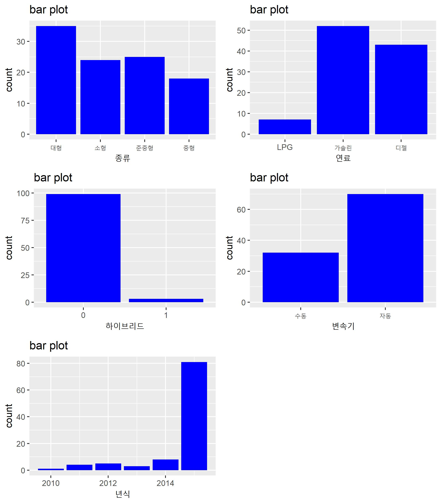

Regression1.Car Price
================
JayHKim
2020-06-26

# Introduce

Car Price 예제를 R을 활용하여 분석한다.

# EDA (Exploratory Data Analysis) 탐색적 데이터 분석

데이터를 다양한 각도에서 살펴보고 이해하는 과정으로 실제적으로 데이터 분석을 하기에 앞서 대표값, 그래프, 통계적 검정 등을 통해
자료를 직관적으로 살펴보는 과정이다. 데이터가 가진 특성과 문제점을 먼저 살펴보고 방법론 등을 선택할 수 있으며, 향후 데이터를
분석하는 중에 발생하는 문제를 사전에 방지하는 효과를 볼수 있다. 실제로 데이터는 결측치, 이상치 등의 문제를 가질수 있으며
이러한 문제를 포함하는 데이터는 분석 모델의 신뢰도와 정확도를 감소시킨다. 또한, EDA 과정이 수반되지 않은 상태에서
분석(예측) 모델을 생성하면 예측 모델의 성능이 낮을 가능성이 있으며, 데이터를 단편적으로 바라보고 구성함에 따라
중요한 패턴을 누락한 상태에서 모델을 생성하는 우를 범할 수 있다.

EDA는 기본적으로 문제 정의 단계에서 세웠던 연구 가설을 바탕으로 진행된다. EDA 시 가장 먼저 확인할 사항은 데이터의
dimension과 각 변수의 속성을 이해하는 것이다. 이를 위해 제공된 데이터 description에 나와 있는 설명과 실제
데이터가 부합하는지를 체크해야 한다. 다음으로 각 변수의 속성에 따라서 대표값과 범주 등을 살펴보고, 누락되거나 잘못
입력된 값이 있는지 확인한다. 결측값의 경우 해당 결측값의 개수와 결측이 일어난 이유, 결측값의 패턴이 무작위적인지
인위적으로 누락된 것인지에 따라서 대체와 삭제를 고려한다. 또한 이상치의 경우 입력 오류 때문인지, 매우 드믈게 발생하는
이상치 인지 등에 따라 구별하여 대체 혹은 삭제한다. 보통 대체의 방법은 대표값으로 채우거나 다른 변수를 통해 유추하는 방식을
택하게 된다. (이에 대한 구체적인 사항은 다음에 추가적으로 작성할 예정이다.) 물론 이 과정에서 데이터의 특성을 바라보기 위한
과정이 단순히 데이터의 평균, 분산, 범위, 범주, 빈도 등과 같은 대표값만으로 확인된다면 이는 다분히 단편적 정보로 데이터를
평가하는 것이기 때문에 각 변수의 분포를 살펴 보는 이외에도 그래프를 통한 시각화와 가설 검정을 통한 변수의 유의성 체크 등도
같이 사용된다. EDA는 실제 데이터에 따라서 그 방법이 매우 다양하고, 모든 데이터 마다 다른 방법을 사용해야 하는
경우가 많아 여기서 부터는 데이터를 살펴 보며 그때 그때 왜 이러한 EDA를 진행했는지 설명하도록 한다.

  - 먼저 필요한 라이브러리를 불러온다. 보통 라이브러리는 한번에 불러오거나 그때그때 추가를 하게 되는데, 기본적으로 항상
    사용되거나 당장 필요한 library를 가져오며, 여기서는 아래 세가지 라이브러리를 먼저 불러오고 그때그때
    사용할 함수의 라이브러리를 불러온 뒤 정리하여 적어놓겠다. ( 분석을 할때 보통 모든 라이브러리를 먼저 불러와서
    진행하지는 않는다. 내가 어떤 라이브러리를 사용하게 될지는 데이터를 살펴 본 이후에 알게 되는 경우도 많다.)

<!-- end list -->

``` r
library(data.table)
library(dplyr)
library(ggplot2)
library(gridExtra)
```

  - 다음으로 데이터를 불러오고 해당 데이터를 살펴 본다.

데이터를 불러올 때, 다양한 함수를 사용하지만 가장 기본적인 함수는 read.txt()나 read.csv() 등을 사용한다.
하지만, 해당 함수는 속도가 느려 데이터 파일이 커졌을 때 좋지않다. 따라서 여기서는 data.tabe 라이브러리내에
fread()를 사용하였다.

``` r
car_price <-fread('C:/Users/afeve/Documents/Tutorials/Regression/Car_Price/carprice_total.csv', encoding = 'UTF-8')
```

다음으로 데이터의 차원(레코드와 컬럼의 개수 )을 살펴 보기 위해서 dim()를 사용하였다.

``` r
dim(car_price)
```

    ## [1] 102  11

head()함수는 데이터의 일부를 보여준다. 뒤에 인자로 숫자를 넣어서 개수를 지정할수 있다.

``` r
head(car_price, 10)
```

    ##     가격 년식   종류 연비 마력 토크   연료 하이브리드 배기량 중량 변속기
    ##  1: 1885 2015 준중형 11.8  172 21.0 가솔린          0   1999 1300   자동
    ##  2: 2190 2015 준중형 12.3  204 27.0 가솔린          0   1591 1300   자동
    ##  3: 1135 2015   소형 15.0  100 13.6 가솔린          0   1368 1035   수동
    ##  4: 1645 2014   소형 14.0  140 17.0 가솔린          0   1591 1090   자동
    ##  5: 1960 2015   대형  9.6  175 46.0   디젤          0   2497 1990   자동
    ##  6: 3277 2015   중형 12.4  200 44.5   디젤          0   2199 1864   자동
    ##  7: 3065 2015   중형 13.8  200 44.5   디젤          0   2199 1799   자동
    ##  8: 1459 2014   소형 14.1  100 13.6 가솔린          0   1368 1095   자동
    ##  9: 2695 2015   중형 10.8  245 36.0 가솔린          0   1998 1570   자동
    ## 10: 1492 2015   소형 14.0  100 13.6 가솔린          0   1368 1103   자동

tail()함수는 head()와 비슷한 기능을 하지만 반대로 데이터를 뒤에서 부터 보여준다.

``` r
tail(car_price, 10)
```

    ##      가격 년식   종류 연비 마력 토크   연료 하이브리드 배기량 중량 변속기
    ##  1:  1845 2015 준중형 13.0  140 17.0 가솔린          0   1591 1225   수동
    ##  2: 14570 2015   대형  7.4  416 52.0 가솔린          0   5038 2145   자동
    ##  3:  1890 2015 준중형 11.8  172 21.0 가솔린          0   1999 1325   자동
    ##  4:  1690 2015 준중형 12.4  215 21.3 가솔린          0   1999 1216   자동
    ##  5:  1410 2015 준중형 14.0  140 17.0 가솔린          0   1591 1210   자동
    ##  6:  6910 2015   대형  8.9  334 40.3 가솔린          0   3778 1915   자동
    ##  7:  2545 2015   대형  8.7  175 46.0   디젤          0   2497 2383   수동
    ##  8:  1960 2015   대형  9.6  175 46.0   디젤          0   2497 1990   자동
    ##  9:   870 2010   소형 13.0   95 12.7 가솔린          0   1399 1046   자동
    ## 10:  2879 2015   중형 14.8  200 43.0   디젤          0   2199 1760   수동

str() 함수는 해당 데이터의 class와 레코드 수, 변수의 개수 이외에 추가적으로 각 변수의 자료형과 값의 일부를 보여준다.
str()함수를 통해 자료 자체를 살펴볼수도 있지만 우리가 인식하기에는 head()함수를 통해 나오는 결과값과 같은 형태가
익숙하기 때문에 보통 추가적으로 작성하기도 한다.

``` r
str(car_price)
```

    ## Classes 'data.table' and 'data.frame':   102 obs. of  11 variables:
    ##  $ 가격      : int  1885 2190 1135 1645 1960 3277 3065 1459 2695 1492 ...
    ##  $ 년식      : int  2015 2015 2015 2014 2015 2015 2015 2014 2015 2015 ...
    ##  $ 종류      : chr  "준중형" "준중형" "소형" "소형" ...
    ##  $ 연비      : num  11.8 12.3 15 14 9.6 12.4 13.8 14.1 10.8 14 ...
    ##  $ 마력      : int  172 204 100 140 175 200 200 100 245 100 ...
    ##  $ 토크      : num  21 27 13.6 17 46 44.5 44.5 13.6 36 13.6 ...
    ##  $ 연료      : chr  "가솔린" "가솔린" "가솔린" "가솔린" ...
    ##  $ 하이브리드: int  0 0 0 0 0 0 0 0 0 0 ...
    ##  $ 배기량    : int  1999 1591 1368 1591 2497 2199 2199 1368 1998 1368 ...
    ##  $ 중량      : int  1300 1300 1035 1090 1990 1864 1799 1095 1570 1103 ...
    ##  $ 변속기    : chr  "자동" "자동" "수동" "자동" ...
    ##  - attr(*, ".internal.selfref")=<externalptr>

위 head(),tail(), str() 등의 함수가 R base내 내장된 함수라면, glimpse()함수의 경우 dplyr
package에서 제공하는 함수로 str()과 거으이 동일하나 형식이 조금 다르다. 개인적으로는 glimpse()함수를 선호하는
편이다.

``` r
glimpse(car_price)
```

    ## Rows: 102
    ## Columns: 11
    ## $ 가격       <int> 1885, 2190, 1135, 1645, 1960, 3277, 3065, 1459, 2695, 1492...
    ## $ 년식       <int> 2015, 2015, 2015, 2014, 2015, 2015, 2015, 2014, 2015, 2015...
    ## $ 종류       <chr> "준중형", "준중형", "소형", "소형", "대형", "중형", "중형", "소형", "중형", "소...
    ## $ 연비       <dbl> 11.8, 12.3, 15.0, 14.0, 9.6, 12.4, 13.8, 14.1, 10.8, 14.0,...
    ## $ 마력       <int> 172, 204, 100, 140, 175, 200, 200, 100, 245, 100, 184, 200...
    ## $ 토크       <dbl> 21.0, 27.0, 13.6, 17.0, 46.0, 44.5, 44.5, 13.6, 36.0, 13.6...
    ## $ 연료       <chr> "가솔린", "가솔린", "가솔린", "가솔린", "디젤", "디젤", "디젤", "가솔린", "가솔린"...
    ## $ 하이브리드 <int> 0, 0, 0, 0, 0, 0, 0, 0, 0, 0, 0, 0, 0, 0, 0, 0, 0, 0, 0, 0, 0...
    ## $ 배기량     <int> 1999, 1591, 1368, 1591, 2497, 2199, 2199, 1368, 1998, 1368,...
    ## $ 중량       <int> 1300, 1300, 1035, 1090, 1990, 1864, 1799, 1095, 1570, 1103...
    ## $ 변속기     <chr> "자동", "자동", "수동", "자동", "자동", "자동", "자동", "자동", "자동", "자동",...

다음으로 is.na() 함수를 사용하여 결측값을 확인한다.

``` r
sum(is.na(car_price))
```

    ## [1] 0

위 함수를 통해서 결측값의 개수를 살펴 볼 수 있지만 구체적으로 결측값이 어떤 컬럼(변수)에 존재하는지를 알 수 없기 때문에
아래의 함수를 통해 각 컬럼별로 결측값의 개수를 체크한다.

``` r
colSums(is.na(car_price))
```

    ##       가격       년식       종류       연비       마력       토크       연료 
    ##          0          0          0          0          0          0          0 
    ## 하이브리드     배기량       중량     변속기 
    ##          0          0          0          0

summary()는 데이터의 대표값을 계산해주는 함수로 최소값, 1사분위수, 중앙값, 평균, 3사분위수, 최대값을 보여준다.
summary() : min, 1Q, median, mean, 3Q, max

``` r
summary(car_price, digits=3)
```

    ##       가격            년식          종류                연비           마력    
    ##  Min.   :  870   Min.   :2010   Length:102         Min.   : 6.3   Min.   : 95  
    ##  1st Qu.: 1560   1st Qu.:2015   Class :character   1st Qu.: 9.6   1st Qu.:136  
    ##  Median : 2007   Median :2015   Mode  :character   Median :12.6   Median :170  
    ##  Mean   : 2503   Mean   :2015                      Mean   :12.4   Mean   :176  
    ##  3rd Qu.: 2838   3rd Qu.:2015                      3rd Qu.:14.2   3rd Qu.:200  
    ##  Max.   :14570   Max.   :2015                      Max.   :19.0   Max.   :416  
    ##       토크          연료             하이브리드         배기량    
    ##  Min.   :12.7   Length:102         Min.   :0.0000   Min.   :1368  
    ##  1st Qu.:19.6   Class :character   1st Qu.:0.0000   1st Qu.:1591  
    ##  Median :27.8   Mode  :character   Median :0.0000   Median :1999  
    ##  Mean   :29.4                      Mean   :0.0294   Mean   :2149  
    ##  3rd Qu.:41.0                      3rd Qu.:0.0000   3rd Qu.:2462  
    ##  Max.   :52.0                      Max.   :1.0000   Max.   :5038  
    ##       중량         변속기         
    ##  Min.   :1035   Length:102        
    ##  1st Qu.:1212   Class :character  
    ##  Median :1588   Mode  :character  
    ##  Mean   :1564                     
    ##  3rd Qu.:1904                     
    ##  Max.   :2383

위 과정이 끝나면 데이터에 대한 계략적인 이해를 할수 있다. 하지만, 이를 통해 얻을수 있는 정보는 제한적이기 때문에 각 변수형에
따라 추가적인 정보를 알아볼 필요가 있다. 일반적으로 연속형 변수, 범주형 변수는 다르기 때문에 이에 해당하는 변수명을 먼저
구하고 추가적인 분석을 진행한다. 아래 code는 데이터내 숫자형 변수인지를 컬럼별로 체크하여 이에 해당하는 컬럼의
이름과 순서 값을 체크하고 그중 이름만을 반환하는 함수이다.

``` r
num_var<- which(sapply(car_price,is.numeric ))  %>% names() 
```

위 결과 중에, hybrid는 0과 1 값만을 가지는 것으로 보이며 이는 숫자형이라기 보다는

``` r
num_var<- num_var[!num_var %in% c('하이브리드')]
```

문자형 변수인지를 확인한다. 현재는 모든 범주형 변수가 character로 나와 있기 때문에 character변수들을
factor로 변환한 후에 진행한다. (factor형은 R에서만 가지는 고유한 자료형이다.) 여기서 사용한 apply함수는
sapply의 경우 vector 형을 반환하고, lapply의 경우 리스트형태로 출력된다. 이외에도 많지만 이에 대한 설명은
여기서 진행하지 않는다.

``` r
chr_var <- which(sapply(car_price,is.character)) %>% names()
chr_var
```

    ## [1] "종류"   "연료"   "변속기"

``` r
car_price[ ,chr_var]<-lapply(car_price %>% select(chr_var), factor)
```

``` r
car_price$하이브리드<-as.factor(car_price$하이브리드)
```

변수를 factor형으로 바꾼후에 factor 헝변수의 이름을 따로 저장한다. 이유는 위에서 언급했던 것처럼 연속형 변수와 범주형
변수를 살펴보는 방법이 다르기 때문에 미리 저장해 놓는것이다.

``` r
fact_var<-which(sapply(car_price,is.factor)) %>% names()
fact_var
```

    ## [1] "종류"       "연료"       "하이브리드" "변속기"

## 수치형 변수의 경우

수치형 변수는 크게 실수형과 정수형으로 구분되며, 어떤 데이터의 경우에 정수형 데이터가 수량이 아니라 단순 구분을 위해서 입력된
값인 경우에 위에서 character변수를 factor로 바꾼것처럼 factor형 변수로 사용되기도 한다. 정수형임에도 정수의
범위가 매우 한정적이고, 순서를 가지지 않는 경우 이를 factor 형으로 사용한다.

수치형 변수는 크게 대표값과 상자 그림, 히스토그램 등을 통해서 변수별 분포를 살펴본다. 먼저 대표값을 수치로 확인하기 위해서
사용되는 함수는 위에서 설명했던 summary()함수가 있는데, 이는 R base에서 기본적으로 제공되는 함수이며,
제공하는 값이 Qunatile(분위수) 정도 밖에 없어서 데이터가 부족하다. 따라서 대안으로 사용될수 있는 함수는
psych패키지의 describe()함수와 pastecs 패키지의 stat.desc(cars)함수를 주로 사용한다. 개인적으로는
describe()함수를 선호하는 편이지만 더 많은 정보를 제공하는 함수는 stat.desc(cars)함수이다. 이때 주의할
사항은 숫자형 변수를 지정한 상태로 함수의 인자로 넣어야 한다. 만약 그렇지 않다면 describe()함수의 경우는
오류가 발생한다.

  - 해당 옵션은 숫자가 지수로 보이는 것을 방지한다.
  - r options(scipen = 10)

<!-- end list -->

``` r
psych::describe(car_price %>% select(num_var)) %>% round(3)
```

    ##        vars   n    mean      sd  median trimmed    mad    min   max   range
    ## 가격      1 102 2502.86 1837.27 2007.00 2178.93 822.84  870.0 14570 13700.0
    ## 년식      2 102 2014.51    1.13 2015.00 2014.83   0.00 2010.0  2015     5.0
    ## 연비      3 102   12.37    3.17   12.60   12.36   2.74    6.3    19    12.7
    ## 마력      4 102  176.45   64.06  170.00  167.62  44.48   95.0   416   321.0
    ## 토크      5 102   29.44   11.99   27.75   29.17  18.75   12.7    52    39.3
    ## 배기량    6 102 2149.07  723.80 1999.00 2040.16 611.57 1368.0  5038  3670.0
    ## 중량      7 102 1564.08  376.56 1587.50 1557.23 515.20 1035.0  2383  1348.0
    ##         skew kurtosis     se
    ## 가격    4.01    20.67 181.92
    ## 년식   -2.33     4.39   0.11
    ## 연비   -0.03    -0.63   0.31
    ## 마력    1.44     2.55   6.34
    ## 토크    0.15    -1.40   1.19
    ## 배기량  1.59     3.45  71.67
    ## 중량    0.01    -1.29  37.28

pastecs 패키지의 stat.desc(cars)함수를 사용하는 것이 좋아보인다. stat.desc()함수는 사분위수를 제외한
거의 모든 정보를 제공한다.

``` r
pastecs::stat.desc(car_price%>% select(num_var)) %>% round(3)
```

    ##                     가격       년식     연비      마력     토크     배기량
    ## nbr.val          102.000    102.000  102.000   102.000  102.000    102.000
    ## nbr.null           0.000      0.000    0.000     0.000    0.000      0.000
    ## nbr.na             0.000      0.000    0.000     0.000    0.000      0.000
    ## min              870.000   2010.000    6.300    95.000   12.700   1368.000
    ## max            14570.000   2015.000   19.000   416.000   52.000   5038.000
    ## range          13700.000      5.000   12.700   321.000   39.300   3670.000
    ## sum           255292.000 205480.000 1261.500 17998.000 3003.300 219205.000
    ## median          2007.000   2015.000   12.600   170.000   27.750   1999.000
    ## mean            2502.863   2014.510   12.368   176.451   29.444   2149.069
    ## SE.mean          181.917      0.112    0.314     6.342    1.187     71.667
    ## CI.mean.0.95     360.874      0.222    0.624    12.582    2.356    142.168
    ## var          3375551.446      1.282   10.083  4103.003  143.818 523890.837
    ## std.dev         1837.267      1.132    3.175    64.055   11.992    723.803
    ## coef.var           0.734      0.001    0.257     0.363    0.407      0.337
    ##                    중량
    ## nbr.val         102.000
    ## nbr.null          0.000
    ## nbr.na            0.000
    ## min            1035.000
    ## max            2383.000
    ## range          1348.000
    ## sum          159536.000
    ## median         1587.500
    ## mean           1564.078
    ## SE.mean          37.285
    ## CI.mean.0.95     73.964
    ## var          141799.103
    ## std.dev         376.562
    ## coef.var          0.241

다음으로 각 변수별 히스토그램과 커널 밀도 곡선을 통해 분포를 살펴본다. 물론 위에서 구한 수치로 이를 어느정도 알수 있지만 시각
정보가 이를 더 명확하게 보여주고, 어느 때는 더 많은 정보를 보여주기 때문에 함께 살펴 보아야 한다.

``` r
p1<-ggplot(car_price, aes(x=가격, y=..density..)) + 
   geom_histogram(binwidth=500, fill = "blue", colour="white", alpha=0.5) + 
   geom_density(fill = NA, colour=NA, alpha=0.8) + 
   geom_line(stat="density") + 
   expand_limits(y=0) + 
   ggtitle("Histogram + Kernel Density Curve")
```

``` r
p2<-ggplot(car_price, aes(x=년식, y=..density..)) + 
   geom_histogram(binwidth=1, fill = "blue", colour="white", alpha=0.5) + 
   geom_density(fill = NA, colour=NA, alpha=0.8) + 
   geom_line(stat="density") + 
   expand_limits(y=0) + 
   ggtitle("Histogram + Kernel Density Curve")
```

``` r
p3<-ggplot(car_price, aes(x=중량, y=..density..)) + 
   geom_histogram(binwidth=50, fill = "blue", colour="white", alpha=0.5) + 
   geom_density(fill = NA, colour=NA, alpha=0.8) + 
   geom_line(stat="density") + 
   expand_limits(y=0) + 
   ggtitle("Histogram + Kernel Density Curve")
```

``` r
p4<-ggplot(car_price, aes(x=연비, y=..density..)) + 
   geom_histogram(binwidth=1, fill = "blue", colour="white", alpha=0.5) + 
   geom_density(fill = NA, colour=NA, alpha=0.8) + 
   geom_line(stat="density") + 
   expand_limits(y=0) + 
   ggtitle("Histogram + Kernel Density Curve")
```

``` r
p5<-ggplot(car_price, aes(x=마력, y=..density..)) + 
   geom_histogram(binwidth=50, fill = "blue", colour="white", alpha=0.5) + 
   geom_density(fill = NA, colour=NA, alpha=0.8) + 
   geom_line(stat="density") + 
   expand_limits(y=0) + 
   ggtitle("Histogram + Kernel Density Curve")
```

``` r
p6<-ggplot(car_price, aes(x=토크, y=..density..)) + 
   geom_histogram(binwidth=5, fill = "blue", colour="white", alpha=0.5) + 
   geom_density(fill = NA, colour=NA, alpha=0.8) + 
   geom_line(stat="density") + 
   expand_limits(y=0) + 
   ggtitle("Histogram + Kernel Density Curve")
```

``` r
p7<-ggplot(car_price, aes(x=배기량, y=..density..)) + 
   geom_histogram(binwidth=500, fill = "blue", colour="white", alpha=0.5) + # alpha 반투명
   geom_density(fill = NA, colour=NA, alpha=0.8) + 
   geom_line(stat="density") + 
   expand_limits(y=0) + 
   ggtitle("Histogram + Kernel Density Curve")
```

위에서 저장한 plot을 화면 분할하여 표시

``` r
grid.arrange(p1, p2,p3,p4,p5,p6,p7, ncol=2)
```


결과 해석:

아래 그래프는 qqplot으로 해당 변수의 모집단 분포가 정규성을 만족하는지를 알아보기 위한 단계로 qqplot과 qqline,
shapiro.test (Shapiro-Wilk normality test)등으로 그래프와 가설 검정을 통해서 살펴본다.

``` r
q1<-ggplot(car_price, aes(sample = 가격)) + 
    geom_qq(color='black', alpha=0.5) + # alpha 반투명  
    geom_qq_line(color='grey')+
    ggtitle("Q-QPlot")
q1
```


아래 Shapiro-Wilk normality test의 가설은 다음과 같다.

귀무가설 H0 : 모집단은 정규분포를 따른다

대립가설 H1 : 모집단은 정규분포를 따르지 않는다

``` r
# Shapiro-Wilk normality test
shapiro.test(car_price$가격)
```

    ## 
    ##  Shapiro-Wilk normality test
    ## 
    ## data:  car_price$가격
    ## W = 0.60463, p-value = 3.697e-15

## 범주형 변수의 경우

범주형 데이터는 연속형 변수와 달라 평균이나, 분산들이 큰 의미가 없다.(물론, 0,1 값만 가지는 경우에 평균이 0.5라면 값이
고르게 분포해 있다던가는 알수 있겠지만) 범주형 변수는 보통 테이블을 통해서 보는데 table이나 이를 비율로 바꾸어 보여주는
prop.table(), 그리고 포뮬러를 함께 사용할수 있는 xtabs() 함수 등이 있다. 개인적인 선호는 table을
기본적으로 사용하고, 여러 테이블을 한꺼번에 보고자 할때는 xtabs의 포뮬러를 사용해서본다.

``` r
table(car_price$종류,useNA = "ifany") # NA를 분할표에 포함
```

    ## 
    ##   대형   소형 준중형   중형 
    ##     35     24     25     18

``` r
#prop.table(car_price$종류)
```

``` r
xtabs(~종류, car_price)
```

    ## 종류
    ##   대형   소형 준중형   중형 
    ##     35     24     25     18

``` r
bar1<-ggplot(car_price, aes(종류)) + 
   geom_bar(fill='blue',stat='count') + # stat='count' 빈도를 표시시
   ggtitle("bar plot")
```

``` r
bar2<-ggplot(car_price, aes(연료)) + 
   geom_bar(fill='blue',stat='count') + # stat='count' 빈도를 표시시
   ggtitle("bar plot")
```

``` r
bar3<-ggplot(car_price, aes(하이브리드)) + 
   geom_bar(fill='blue',stat='count') + # stat='count' 빈도를 표시시
   ggtitle("bar plot")
```

``` r
bar4<-ggplot(car_price, aes(변속기)) + 
   geom_bar(fill='blue',stat='count') + # stat='count' 빈도를 표시시
   ggtitle("bar plot")
```

``` r
bar5<-ggplot(car_price, aes(년식)) + 
   geom_bar(fill='blue',stat='count') + # stat='count' 빈도를 표시시
   ggtitle("bar plot")
```

위에서 저장한 plot을 화면 분할하여 표시

``` r
grid.arrange(bar1, bar2,bar3,bar4,bar5, ncol=2)
```



위 summary()함수는 R base에서 기본적으로 제공되는 함수이며, 제공하는 값이 Qunatile(분위수) 정도 밖에 없어서
부족하다. 따라서 대안으로 사용될수 있는 함수는 psych패키지의 describe()함수와 pastecs 패키지의
stat.desc(cars)함수를 사용하는 것이 좋아보인다. 개인적으로는 describe()함수를 선호하는 편이지만 더 많은
정보를 제공하는 함수는 stat.desc(cars)함수이다.

``` r
#psych::describe(car_price)
```

pastecs 패키지의 stat.desc(cars)함수를 사용하는 것이 좋아보인다.

``` r
pastecs::stat.desc(car_price)
```

    ##                      가격         년식 종류         연비         마력
    ## nbr.val      1.020000e+02 1.020000e+02   NA  102.0000000 1.020000e+02
    ## nbr.null     0.000000e+00 0.000000e+00   NA    0.0000000 0.000000e+00
    ## nbr.na       0.000000e+00 0.000000e+00   NA    0.0000000 0.000000e+00
    ## min          8.700000e+02 2.010000e+03   NA    6.3000000 9.500000e+01
    ## max          1.457000e+04 2.015000e+03   NA   19.0000000 4.160000e+02
    ## range        1.370000e+04 5.000000e+00   NA   12.7000000 3.210000e+02
    ## sum          2.552920e+05 2.054800e+05   NA 1261.5000000 1.799800e+04
    ## median       2.007000e+03 2.015000e+03   NA   12.6000000 1.700000e+02
    ## mean         2.502863e+03 2.014510e+03   NA   12.3676471 1.764510e+02
    ## SE.mean      1.819166e+02 1.121134e-01   NA    0.3144027 6.342359e+00
    ## CI.mean.0.95 3.608736e+02 2.224029e-01   NA    0.6236905 1.258153e+01
    ## var          3.375551e+06 1.282081e+00   NA   10.0826063 4.103003e+03
    ## std.dev      1.837267e+03 1.132290e+00   NA    3.1753120 6.405468e+01
    ## coef.var     7.340664e-01 5.620674e-04   NA    0.2567434 3.630169e-01
    ##                     토크 연료 하이브리드       배기량         중량 변속기
    ## nbr.val       102.000000   NA         NA 1.020000e+02 1.020000e+02     NA
    ## nbr.null        0.000000   NA         NA 0.000000e+00 0.000000e+00     NA
    ## nbr.na          0.000000   NA         NA 0.000000e+00 0.000000e+00     NA
    ## min            12.700000   NA         NA 1.368000e+03 1.035000e+03     NA
    ## max            52.000000   NA         NA 5.038000e+03 2.383000e+03     NA
    ## range          39.300000   NA         NA 3.670000e+03 1.348000e+03     NA
    ## sum          3003.300000   NA         NA 2.192050e+05 1.595360e+05     NA
    ## median         27.750000   NA         NA 1.999000e+03 1.587500e+03     NA
    ## mean           29.444118   NA         NA 2.149069e+03 1.564078e+03     NA
    ## SE.mean         1.187426   NA         NA 7.166718e+01 3.728522e+01     NA
    ## CI.mean.0.95    2.355533   NA         NA 1.421684e+02 7.396384e+01     NA
    ## var           143.817935   NA         NA 5.238908e+05 1.417991e+05     NA
    ## std.dev        11.992412   NA         NA 7.238030e+02 3.765622e+02     NA
    ## coef.var        0.407294   NA         NA 3.367985e-01 2.407566e-01     NA

``` r
table(car_price$종류, car_price$연료)
```

    ##         
    ##          LPG 가솔린 디젤
    ##   대형     6     12   17
    ##   소형     0     20    4
    ##   준중형   1     12   12
    ##   중형     0      8   10

``` r
table(car_price$종류, car_price$연료)
```

    ##         
    ##          LPG 가솔린 디젤
    ##   대형     6     12   17
    ##   소형     0     20    4
    ##   준중형   1     12   12
    ##   중형     0      8   10

``` r
table(car_price$종류, car_price$변속기)
```

    ##         
    ##          수동 자동
    ##   대형     11   24
    ##   소형      9   15
    ##   준중형   10   15
    ##   중형      2   16

``` r
table( car_price$연료, car_price$변속기)
```

    ##         
    ##          수동 자동
    ##   LPG       3    4
    ##   가솔린   12   40
    ##   디젤     17   26

``` r
table(car_price$종류, car_price$연료, car_price$변속기)
```

    ## , ,  = 수동
    ## 
    ##         
    ##          LPG 가솔린 디젤
    ##   대형     3      0    8
    ##   소형     0      7    2
    ##   준중형   0      5    5
    ##   중형     0      0    2
    ## 
    ## , ,  = 자동
    ## 
    ##         
    ##          LPG 가솔린 디젤
    ##   대형     3     12    9
    ##   소형     0     13    2
    ##   준중형   1      7    7
    ##   중형     0      8    8

-----

### 단축키

가) chunk생성: Ctrl + Alt + I

나) knit하기: Ctrl + Shift + k

다) 한줄 실행: Ctrl + Enter, chunk실행: Ctrl + Shift + Enter

### 텍스트 작성방법

가) \#: \#을 앞에 붙이면 굵은 문자 스타일로 Viewer창에 출력된다. 많이 붙일수록 더 굵은 문자로 표기된다.

나) —: -기호를 세 번 입력하면 줄이 표시된다.

다) \*: 글머리 기호가 된다.

### 표 작성 방법

| 이름 | 컬럼 |
| -- | -- |
| K  | JH |
| K  | EY |

## 코드내장하기

가) r 코드를 백틱(\`)으로 감싼다. R이 인라인 코드를 실행된 결과로 대체한다

2 더하기 2는 4와 같다

나) R코드 덩어리를 `{r} 으로 시작하고.` 으로 마무리한다

``` r
dim(iris)
```

    ## [1] 150   5

## 화면 출력 선택 옵션

knitr 선택옵션을 사용해서 코드 덩어리 출력 스타일을 적용한다. 코드 상단 괄호 내부에 선택옵션을 지정한다 Here’s
some code

가) 코드를 보여줌

``` r
dim(iris)
```

나) 결과를 보여줌

    ## [1] 150   5

\#\#\#table

1.  직접 입력하기

| 선택옵션       | 기본설정                                      | 효과                              |
| ---------- | ----------------------------------------- | ------------------------------- |
| eval       | TRUE                                      | 코드를 평가하고 실행결과를 포함한다.            |
| echo       | TRUE                                      | 실행결과와 함께 코드를 출력한다.              |
| warning    | TRUE                                      | 경고메시지를 출력한다.                    |
| error      | FALSE                                     | 오류메시지를 출력한다.                    |
| message    | TRUE                                      | 메시지를 출력한다.                      |
| tidy       | FALSE                                     | 깔끔한 방식으로 코드 형태를 변형한다.           |
| results    | “markup” “markup”, “asis”, “hold”, “hide” |                                 |
| cache      | FALSE                                     | 결과값을 캐쉬해서 향후 실행시 건너뛰게 설정한다.     |
| comment    | “\#\#”                                    | 주석문자로 출력결과에 서두를 붙인다.            |
| fig.width  | 7                                         | 덩어리로 생성되는 그래프에 대한 폭을 인치로 지정한다.  |
| fig.height | 7                                         | 덩어리로 생성되는 그래프에 대한 높이을 인치로 지정한다. |

2.  kable을 활용하기

<!-- end list -->

``` r
# kable(iris[1:5, ], caption = "A caption")
```

## Plots 내장하기


``` r
library(knitr)
include_graphics("https://www.tidyverse.org/images/tidyverse-default.png")
```

<div class="figure" style="text-align: center">


<p class="caption">

tidyverse logo

</p>

</div>
