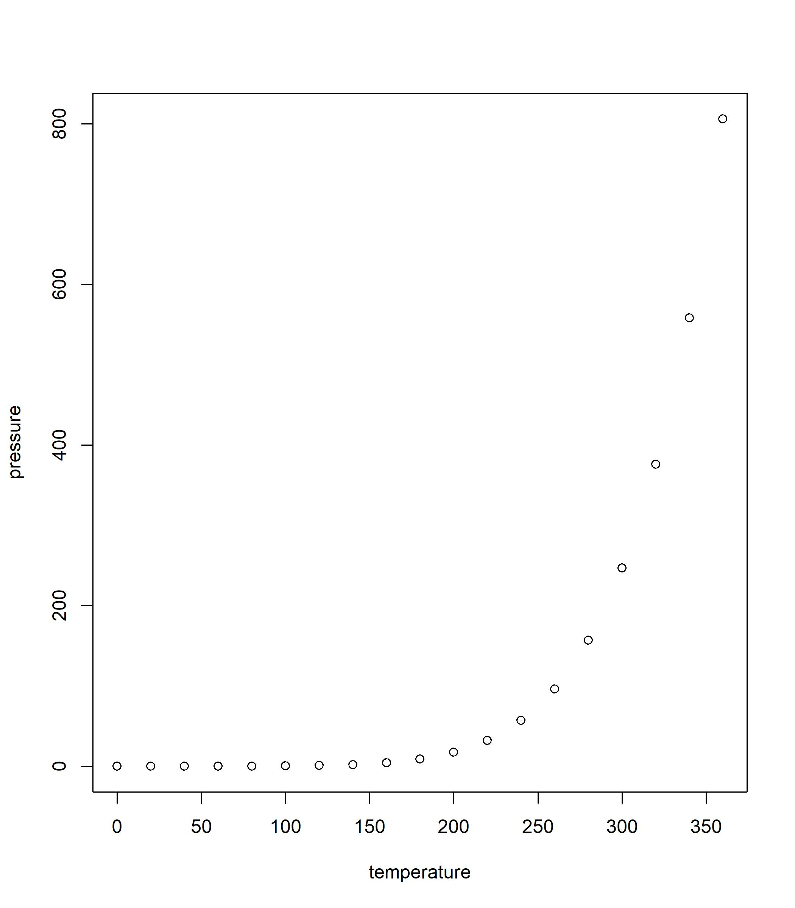

Regression1.Car Price
================
JayHKim
2020-06-24

# Introduce

Car Price 예제를 R을 활용하여 분석한다.

# EDA (Exploratory Data Analysis) 탐색적 데이터 분석

데이터를 다양한 각도에서 살펴보고 이해하는 과정으로 실제적으로 데이터 분석을 하기에 앞서 대표값, 그래프, 통계적 검정 등을 통해
자료를 직관적으로 살펴보는 과정이다. 데이터가 가진 특성과 문제점을 먼저 살펴보고 방법론 등을 선택할 수 있으며, 향후 데이터를
분석하는 중에 발생하는 문제를 사전에 방지하는 효과를 볼수 있다. 실제로 데이터는 결측치, 이상치 등의 문제를 가질수 있으며
이러한 문제를 포함하는 데이터는 분석 모델의 신뢰도와 정확도를 감소시킨다. 또한, EDA 과정이 수반되지 않은 상태에서
분석(예측) 모델을 생성하면 예측 모델의 성능이 낮을 가능성이 있으며, 데이터를 단편적으로 바라보고 구성함에 따라
중요한 패턴을 누락한 상태에서 모델을 생성하는 우를 범할 수 있다.

EDA는 기본적으로 문제 정의 단계에서 세웠던 연구 가설을 바탕으로 진행된다. EDA 시 가장 먼저 확인할 사항은 데이터의
dimension과 각 변수의 속성을 이해하는 것이다. 이를 위해 제공된 데이터 description에 나와 있는 설명과 실제
데이터가 부합하는지를 체크해야 한다. 다음으로 각 변수의 속성에 따라서 대표값과 범주 등을 살펴보고, 누락되거나 잘못
입력된 값이 있는지 확인한다. 결측값의 경우 해당 결측값의 개수와 결측이 일어난 이유, 결측값의 패턴이 무작위적인지
인위적으로 누락된 것인지에 따라서 대체와 삭제를 고려한다. 또한 이상치의 경우 입력 오류 때문인지, 매우 드믈게 발생하는
이상치 인지 등에 따라 구별하여 대체 혹은 삭제한다. 보통 대체의 방법은 대표값으로 채우거나 다른 변수를 통해 유추하는 방식을
택하게 된다. (이에 대한 구체적인 사항은 다음에 추가적으로 작성할 예정이다.) 물론 이 과정에서 데이터의 특성을 바라보기 위한
과정이 단순히 데이터의 평균, 분산, 범위, 범주, 빈도 등과 같은 대표값만으로 확인된다면 이는 다분히 단편적 정보로 데이터를
평가하는 것이기 때문에 각 변수의 분포를 살펴 보는 이외에도 그래프를 통한 시각화와 가설 검정을 통한 변수의 유의성 체크 등도
같이 사용된다. EDA는 실제 데이터에 따라서 그 방법이 매우 다양하고, 모든 데이터 마다 다른 방법을 사용해야 하는
경우가 많아 여기서 부터는 데이터를 살펴 보며 그때 그때 왜 이러한 EDA를 진행했는지 설명하도록 한다.

  - 먼저 필요한 라이브러리를 불러온다. 보통 라이브러리는 한번에 불러오거나 그때그때 추가를 하게 되는데, 기본적으로 항상
    사용되거나 당장 필요한 library를 가져오며, 여기서는 아래 세가지 라이브러리를 먼저 불러오고 그때그때
    사용할 함수의 라이브러리를 불러온 뒤 정리하여 적어놓겠다. ( 분석을 할때 보통 모든 라이브러리를 먼저 불러와서
    진행하지는 않는다. 내가 어떤 라이브러리를 사용하게 될지는 데이터를 살펴 본 이후에 알게 되는 경우도 많다.)

  - 다음으로 데이터를 불러오고 해당 데이터를 살펴 본다.

<!-- end list -->

    ## [1] 102  11

    ##    가격 년식   종류 연비 마력 토크   연료 하이브리드 배기량 중량 변속기
    ## 1: 1885 2015 준중형 11.8  172 21.0 가솔린          0   1999 1300   자동
    ## 2: 2190 2015 준중형 12.3  204 27.0 가솔린          0   1591 1300   자동
    ## 3: 1135 2015   소형 15.0  100 13.6 가솔린          0   1368 1035   수동
    ## 4: 1645 2014   소형 14.0  140 17.0 가솔린          0   1591 1090   자동
    ## 5: 1960 2015   대형  9.6  175 46.0   디젤          0   2497 1990   자동
    ## 6: 3277 2015   중형 12.4  200 44.5   디젤          0   2199 1864   자동

    ## Classes 'data.table' and 'data.frame':   102 obs. of  11 variables:
    ##  $ 가격      : int  1885 2190 1135 1645 1960 3277 3065 1459 2695 1492 ...
    ##  $ 년식      : int  2015 2015 2015 2014 2015 2015 2015 2014 2015 2015 ...
    ##  $ 종류      : chr  "준중형" "준중형" "소형" "소형" ...
    ##  $ 연비      : num  11.8 12.3 15 14 9.6 12.4 13.8 14.1 10.8 14 ...
    ##  $ 마력      : int  172 204 100 140 175 200 200 100 245 100 ...
    ##  $ 토크      : num  21 27 13.6 17 46 44.5 44.5 13.6 36 13.6 ...
    ##  $ 연료      : chr  "가솔린" "가솔린" "가솔린" "가솔린" ...
    ##  $ 하이브리드: int  0 0 0 0 0 0 0 0 0 0 ...
    ##  $ 배기량    : int  1999 1591 1368 1591 2497 2199 2199 1368 1998 1368 ...
    ##  $ 중량      : int  1300 1300 1035 1090 1990 1864 1799 1095 1570 1103 ...
    ##  $ 변속기    : chr  "자동" "자동" "수동" "자동" ...
    ##  - attr(*, ".internal.selfref")=<externalptr>

    ## Rows: 102
    ## Columns: 11
    ## $ 가격       <int> 1885, 2190, 1135, 1645, 1960, 3277, 3065, 1459, 2695, 1492...
    ## $ 년식       <int> 2015, 2015, 2015, 2014, 2015, 2015, 2015, 2014, 2015, 2015...
    ## $ 종류       <chr> "준중형", "준중형", "소형", "소형", "대형", "중형", "중형", "소형", "중형", "소...
    ## $ 연비       <dbl> 11.8, 12.3, 15.0, 14.0, 9.6, 12.4, 13.8, 14.1, 10.8, 14.0,...
    ## $ 마력       <int> 172, 204, 100, 140, 175, 200, 200, 100, 245, 100, 184, 200...
    ## $ 토크       <dbl> 21.0, 27.0, 13.6, 17.0, 46.0, 44.5, 44.5, 13.6, 36.0, 13.6...
    ## $ 연료       <chr> "가솔린", "가솔린", "가솔린", "가솔린", "디젤", "디젤", "디젤", "가솔린", "가솔린"...
    ## $ 하이브리드 <int> 0, 0, 0, 0, 0, 0, 0, 0, 0, 0, 0, 0, 0, 0, 0, 0, 0, 0, 0, 0, 0...
    ## $ 배기량     <int> 1999, 1591, 1368, 1591, 2497, 2199, 2199, 1368, 1998, 1368,...
    ## $ 중량       <int> 1300, 1300, 1035, 1090, 1990, 1864, 1799, 1095, 1570, 1103...
    ## $ 변속기     <chr> "자동", "자동", "수동", "자동", "자동", "자동", "자동", "자동", "자동", "자동",...

    ##       가격       년식       종류       연비       마력       토크       연료 
    ##          0          0          0          0          0          0          0 
    ## 하이브리드     배기량       중량     변속기 
    ##          0          0          0          0

    ## [1] "가격"       "년식"       "연비"       "마력"       "토크"      
    ## [6] "하이브리드" "배기량"     "중량"

    ## [1] "종류"   "연료"   "변속기"

    ##       가격            년식          종류                연비      
    ##  Min.   :  870   Min.   :2010   Length:102         Min.   : 6.30  
    ##  1st Qu.: 1560   1st Qu.:2015   Class :character   1st Qu.: 9.60  
    ##  Median : 2007   Median :2015   Mode  :character   Median :12.60  
    ##  Mean   : 2503   Mean   :2015                      Mean   :12.37  
    ##  3rd Qu.: 2838   3rd Qu.:2015                      3rd Qu.:14.25  
    ##  Max.   :14570   Max.   :2015                      Max.   :19.00  
    ##       마력            토크           연료             하이브리드     
    ##  Min.   : 95.0   Min.   :12.70   Length:102         Min.   :0.00000  
    ##  1st Qu.:136.0   1st Qu.:19.60   Class :character   1st Qu.:0.00000  
    ##  Median :170.0   Median :27.75   Mode  :character   Median :0.00000  
    ##  Mean   :176.5   Mean   :29.44                      Mean   :0.02941  
    ##  3rd Qu.:200.0   3rd Qu.:41.00                      3rd Qu.:0.00000  
    ##  Max.   :416.0   Max.   :52.00                      Max.   :1.00000  
    ##      배기량          중량         변속기         
    ##  Min.   :1368   Min.   :1035   Length:102        
    ##  1st Qu.:1591   1st Qu.:1212   Class :character  
    ##  Median :1999   Median :1588   Mode  :character  
    ##  Mean   :2149   Mean   :1564                     
    ##  3rd Qu.:2462   3rd Qu.:1904                     
    ##  Max.   :5038   Max.   :2383

    ## 
    ##   대형   소형 준중형   중형 
    ##     35     24     25     18

    ## 
    ##    LPG 가솔린   디젤 
    ##      7     52     43

    ## 
    ## 수동 자동 
    ##   32   70

    ##         
    ##          LPG 가솔린 디젤
    ##   대형     6     12   17
    ##   소형     0     20    4
    ##   준중형   1     12   12
    ##   중형     0      8   10

    ##         
    ##          LPG 가솔린 디젤
    ##   대형     6     12   17
    ##   소형     0     20    4
    ##   준중형   1     12   12
    ##   중형     0      8   10

    ##         
    ##          수동 자동
    ##   대형     11   24
    ##   소형      9   15
    ##   준중형   10   15
    ##   중형      2   16

    ##         
    ##          수동 자동
    ##   LPG       3    4
    ##   가솔린   12   40
    ##   디젤     17   26

    ## , ,  = 수동
    ## 
    ##         
    ##          LPG 가솔린 디젤
    ##   대형     3      0    8
    ##   소형     0      7    2
    ##   준중형   0      5    5
    ##   중형     0      0    2
    ## 
    ## , ,  = 자동
    ## 
    ##         
    ##          LPG 가솔린 디젤
    ##   대형     3     12    9
    ##   소형     0     13    2
    ##   준중형   1      7    7
    ##   중형     0      8    8

-----

### 단축키

가) chunk생성: Ctrl + Alt + I

나) knit하기: Ctrl + Shift + k

다) 한줄 실행: Ctrl + Enter, chunk실행: Ctrl + Shift + Enter

### 텍스트 작성방법

가) \#: \#을 앞에 붙이면 굵은 문자 스타일로 Viewer창에 출력된다. 많이 붙일수록 더 굵은 문자로 표기된다.

나) —: -기호를 세 번 입력하면 줄이 표시된다.

다) \*: 글머리 기호가 된다.

### 표 작성 방법

| 이름 | 컬럼 |
| -- | -- |
| K  | JH |
| K  | EY |

## 코드내장하기

가) r 코드를 백틱(\`)으로 감싼다. R이 인라인 코드를 실행된 결과로 대체한다

2 더하기 2는 4와 같다

나) R코드 덩어리를 `{r} 으로 시작하고.` 으로 마무리한다

    ## [1] 150   5

## 화면 출력 선택 옵션

knitr 선택옵션을 사용해서 코드 덩어리 출력 스타일을 적용한다. 코드 상단 괄호 내부에 선택옵션을 지정한다 Here’s
some code

가) 코드를 보여줌

나) 결과를 보여줌

    ## [1] 150   5

| 선택옵션       | 기본설정                                      | 효과                              |
| ---------- | ----------------------------------------- | ------------------------------- |
| eval       | TRUE                                      | 코드를 평가하고 실행결과를 포함한다.            |
| echo       | TRUE                                      | 실행결과와 함께 코드를 출력한다.              |
| warning    | TRUE                                      | 경고메시지를 출력한다.                    |
| error      | FALSE                                     | 오류메시지를 출력한다.                    |
| message    | TRUE                                      | 메시지를 출력한다.                      |
| tidy       | FALSE                                     | 깔끔한 방식으로 코드 형태를 변형한다.           |
| results    | “markup” “markup”, “asis”, “hold”, “hide” |                                 |
| cache      | FALSE                                     | 결과값을 캐쉬해서 향후 실행시 건너뛰게 설정한다.     |
| comment    | “\#\#”                                    | 주석문자로 출력결과에 서두를 붙인다.            |
| fig.width  | 7                                         | 덩어리로 생성되는 그래프에 대한 폭을 인치로 지정한다.  |
| fig.height | 7                                         | 덩어리로 생성되는 그래프에 대한 높이을 인치로 지정한다. |

## Plots 내장하기

