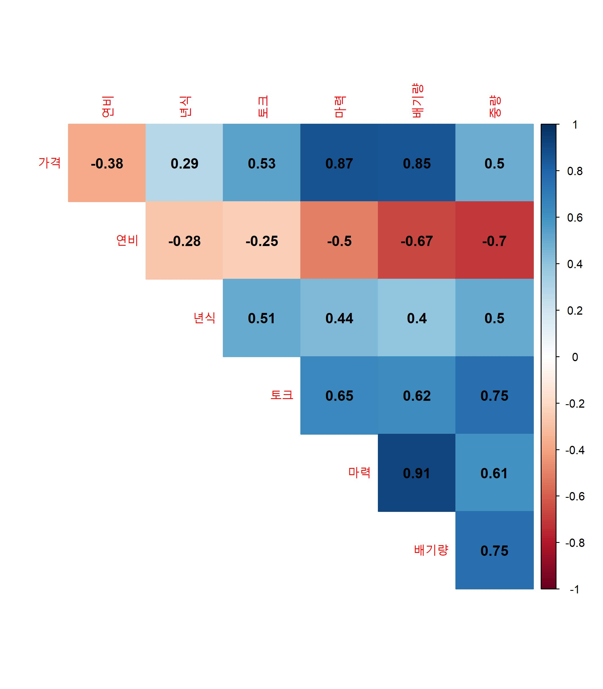
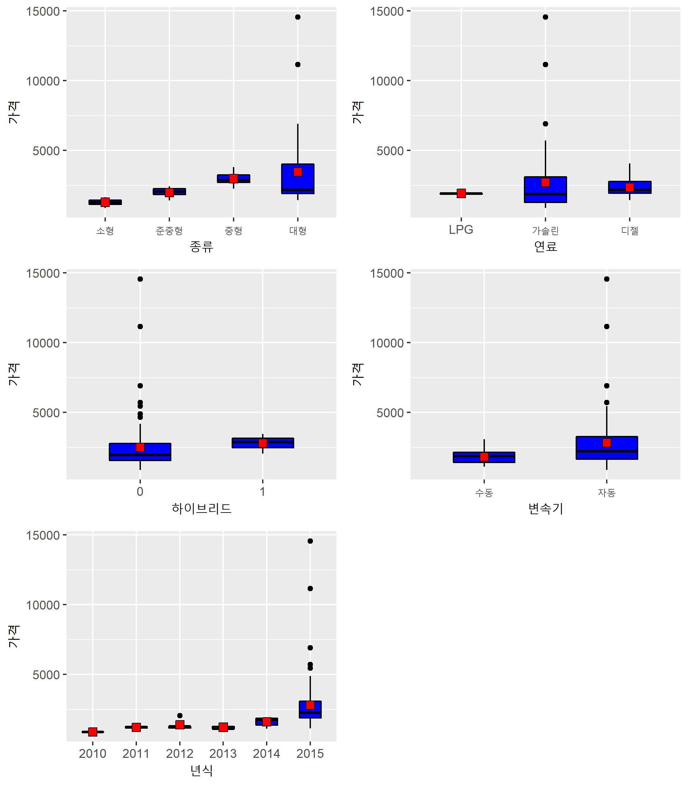
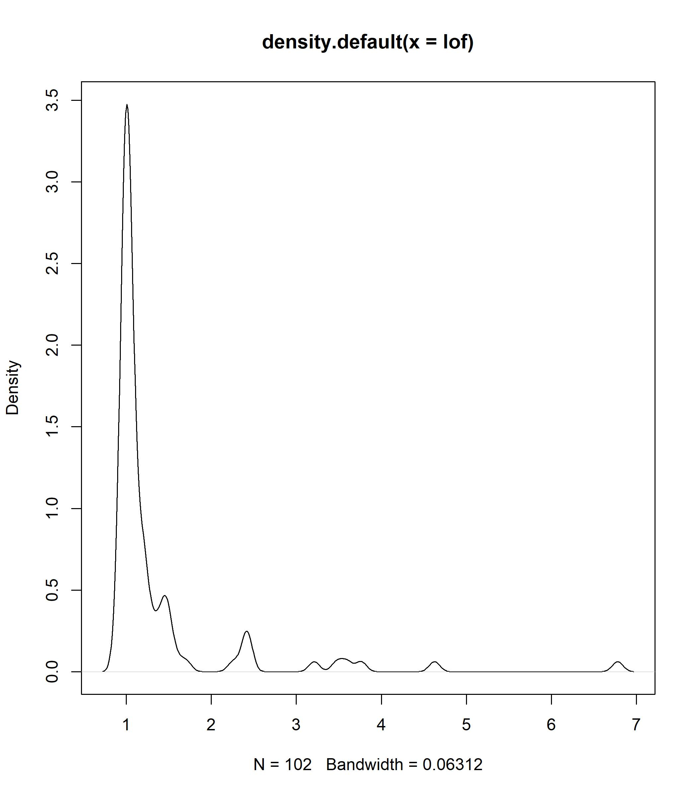
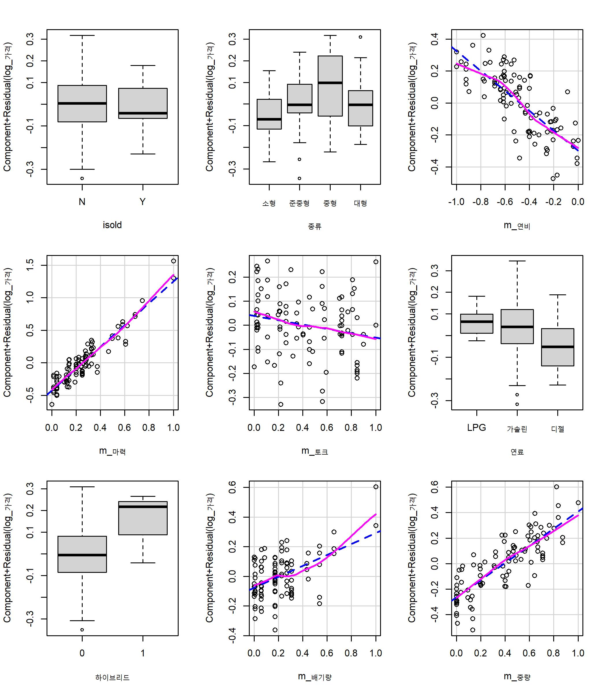

Regression1.Car Price
================
JayHKim
2020-07-02

# Introduce

Car Price 예제를 R을 활용하여 분석한다.

# EDA (Exploratory Data Analysis) 탐색적 데이터 분석

데이터를 다양한 각도에서 살펴보고 이해하는 과정으로 실제적으로 데이터 분석을 하기에 앞서 대표값, 그래프, 통계적 검정 등을 통해
자료를 직관적으로 살펴보는 과정이다. 데이터가 가진 특성과 문제점을 먼저 살펴보고 방법론 등을 선택할 수 있으며, 향후 데이터를
분석하는 중에 발생하는 문제를 사전에 방지하는 효과를 볼수 있다. 실제로 데이터는 결측치, 이상치 등의 문제를 가질수 있으며
이러한 문제를 포함하는 데이터는 분석 모델의 신뢰도와 정확도를 감소시킨다. 또한, EDA 과정이 수반되지 않은 상태에서
분석(예측) 모델을 생성하면 예측 모델의 성능이 낮을 가능성이 있으며, 데이터를 단편적으로 바라보고 구성함에 따라
중요한 패턴을 누락한 상태에서 모델을 생성하는 우를 범할 수 있다.

EDA는 기본적으로 문제 정의 단계에서 세웠던 연구 가설을 바탕으로 진행된다. EDA 시 가장 먼저 확인할 사항은 데이터의
dimension과 각 변수의 속성을 이해하는 것이다. 이를 위해 제공된 데이터 description에 나와 있는 설명과 실제
데이터가 부합하는지를 체크해야 한다. 다음으로 각 변수의 속성에 따라서 대표값과 범주 등을 살펴보고, 누락되거나 잘못
입력된 값이 있는지 확인한다. 결측값의 경우 해당 결측값의 개수와 결측이 일어난 이유, 결측값의 패턴이 무작위적인지
인위적으로 누락된 것인지에 따라서 대체와 삭제를 고려한다. 또한 이상치의 경우 입력 오류 때문인지, 매우 드믈게 발생하는
이상치 인지 등에 따라 구별하여 대체 혹은 삭제한다. 보통 대체의 방법은 대표값으로 채우거나 다른 변수를 통해 유추하는 방식을
택하게 된다. (이에 대한 구체적인 사항은 다음에 추가적으로 작성할 예정이다.) 물론 이 과정에서 데이터의 특성을 바라보기 위한
과정이 단순히 데이터의 평균, 분산, 범위, 범주, 빈도 등과 같은 대표값만으로 확인된다면 이는 다분히 단편적 정보로 데이터를
평가하는 것이기 때문에 각 변수의 분포를 살펴 보는 이외에도 그래프를 통한 시각화와 가설 검정을 통한 변수의 유의성 체크 등도
같이 사용된다. EDA는 실제 데이터에 따라서 그 방법이 매우 다양하고, 모든 데이터 마다 다른 방법을 사용해야 하는
경우가 많아 여기서 부터는 데이터를 살펴 보며 그때 그때 왜 이러한 EDA를 진행했는지 설명하도록 한다.

  - 먼저 필요한 라이브러리를 불러온다. 보통 라이브러리는 한번에 불러오거나 그때그때 추가를 하게 되는데, 기본적으로 항상
    사용되거나 당장 필요한 library를 가져오며, 여기서는 아래 세가지 라이브러리를 먼저 불러오고 그때그때
    사용할 함수의 라이브러리를 불러온 뒤 정리하여 적어놓겠다. ( 분석을 할때 보통 모든 라이브러리를 먼저 불러와서
    진행하지는 않는다. 내가 어떤 라이브러리를 사용하게 될지는 데이터를 살펴 본 이후에 알게 되는 경우도 많다.)

<!-- end list -->

``` r
library(data.table)
library(dplyr)
library(ggplot2)
library(gridExtra)
```

  - 다음으로 데이터를 불러오고 해당 데이터를 살펴 본다.

데이터를 불러올 때, 다양한 함수를 사용하지만 가장 기본적인 함수는 read.txt()나 read.csv() 등을 사용한다.
하지만, 해당 함수는 속도가 느려 데이터 파일이 커졌을 때 좋지않다. 따라서 여기서는 data.tabe 라이브러리내에
fread()를 사용하였다.

``` r
car_price <-fread('C:/Users/afeve/Documents/Tutorials/Regression/Car_Price/carprice_total.csv', encoding = 'UTF-8')
```

다음으로 데이터의 차원(레코드와 컬럼의 개수 )을 살펴 보기 위해서 dim()를 사용하였다.

``` r
dim(car_price)
```

    ## [1] 102  11

head()함수는 데이터의 일부를 보여준다. 뒤에 인자로 숫자를 넣어서 개수를 지정할수 있다.

``` r
head(car_price, 10)
```

    ##     가격 년식   종류 연비 마력 토크   연료 하이브리드 배기량 중량 변속기
    ##  1: 1885 2015 준중형 11.8  172 21.0 가솔린          0   1999 1300   자동
    ##  2: 2190 2015 준중형 12.3  204 27.0 가솔린          0   1591 1300   자동
    ##  3: 1135 2015   소형 15.0  100 13.6 가솔린          0   1368 1035   수동
    ##  4: 1645 2014   소형 14.0  140 17.0 가솔린          0   1591 1090   자동
    ##  5: 1960 2015   대형  9.6  175 46.0   디젤          0   2497 1990   자동
    ##  6: 3277 2015   중형 12.4  200 44.5   디젤          0   2199 1864   자동
    ##  7: 3065 2015   중형 13.8  200 44.5   디젤          0   2199 1799   자동
    ##  8: 1459 2014   소형 14.1  100 13.6 가솔린          0   1368 1095   자동
    ##  9: 2695 2015   중형 10.8  245 36.0 가솔린          0   1998 1570   자동
    ## 10: 1492 2015   소형 14.0  100 13.6 가솔린          0   1368 1103   자동

tail()함수는 head()와 비슷한 기능을 하지만 반대로 데이터를 뒤에서 부터 보여준다.

``` r
tail(car_price, 10)
```

    ##      가격 년식   종류 연비 마력 토크   연료 하이브리드 배기량 중량 변속기
    ##  1:  1845 2015 준중형 13.0  140 17.0 가솔린          0   1591 1225   수동
    ##  2: 14570 2015   대형  7.4  416 52.0 가솔린          0   5038 2145   자동
    ##  3:  1890 2015 준중형 11.8  172 21.0 가솔린          0   1999 1325   자동
    ##  4:  1690 2015 준중형 12.4  215 21.3 가솔린          0   1999 1216   자동
    ##  5:  1410 2015 준중형 14.0  140 17.0 가솔린          0   1591 1210   자동
    ##  6:  6910 2015   대형  8.9  334 40.3 가솔린          0   3778 1915   자동
    ##  7:  2545 2015   대형  8.7  175 46.0   디젤          0   2497 2383   수동
    ##  8:  1960 2015   대형  9.6  175 46.0   디젤          0   2497 1990   자동
    ##  9:   870 2010   소형 13.0   95 12.7 가솔린          0   1399 1046   자동
    ## 10:  2879 2015   중형 14.8  200 43.0   디젤          0   2199 1760   수동

str() 함수는 해당 데이터의 class와 레코드 수, 변수의 개수 이외에 추가적으로 각 변수의 자료형과 값의 일부를 보여준다.
str()함수를 통해 자료 자체를 살펴볼수도 있지만 우리가 인식하기에는 head()함수를 통해 나오는 결과값과 같은 형태가
익숙하기 때문에 보통 추가적으로 작성하기도 한다.

``` r
str(car_price)
```

    ## Classes 'data.table' and 'data.frame':   102 obs. of  11 variables:
    ##  $ 가격      : int  1885 2190 1135 1645 1960 3277 3065 1459 2695 1492 ...
    ##  $ 년식      : int  2015 2015 2015 2014 2015 2015 2015 2014 2015 2015 ...
    ##  $ 종류      : chr  "준중형" "준중형" "소형" "소형" ...
    ##  $ 연비      : num  11.8 12.3 15 14 9.6 12.4 13.8 14.1 10.8 14 ...
    ##  $ 마력      : int  172 204 100 140 175 200 200 100 245 100 ...
    ##  $ 토크      : num  21 27 13.6 17 46 44.5 44.5 13.6 36 13.6 ...
    ##  $ 연료      : chr  "가솔린" "가솔린" "가솔린" "가솔린" ...
    ##  $ 하이브리드: int  0 0 0 0 0 0 0 0 0 0 ...
    ##  $ 배기량    : int  1999 1591 1368 1591 2497 2199 2199 1368 1998 1368 ...
    ##  $ 중량      : int  1300 1300 1035 1090 1990 1864 1799 1095 1570 1103 ...
    ##  $ 변속기    : chr  "자동" "자동" "수동" "자동" ...
    ##  - attr(*, ".internal.selfref")=<externalptr>

위 head(),tail(), str() 등의 함수가 R base내 내장된 함수라면, glimpse()함수의 경우 dplyr
package에서 제공하는 함수로 str()과 거으이 동일하나 형식이 조금 다르다. 개인적으로는 glimpse()함수를 선호하는
편이다.

``` r
glimpse(car_price)
```

    ## Rows: 102
    ## Columns: 11
    ## $ 가격       <int> 1885, 2190, 1135, 1645, 1960, 3277, 3065, 1459, 2695, 1492...
    ## $ 년식       <int> 2015, 2015, 2015, 2014, 2015, 2015, 2015, 2014, 2015, 2015...
    ## $ 종류       <chr> "준중형", "준중형", "소형", "소형", "대형", "중형", "중형", "소형", "중형", "소...
    ## $ 연비       <dbl> 11.8, 12.3, 15.0, 14.0, 9.6, 12.4, 13.8, 14.1, 10.8, 14.0,...
    ## $ 마력       <int> 172, 204, 100, 140, 175, 200, 200, 100, 245, 100, 184, 200...
    ## $ 토크       <dbl> 21.0, 27.0, 13.6, 17.0, 46.0, 44.5, 44.5, 13.6, 36.0, 13.6...
    ## $ 연료       <chr> "가솔린", "가솔린", "가솔린", "가솔린", "디젤", "디젤", "디젤", "가솔린", "가솔린"...
    ## $ 하이브리드 <int> 0, 0, 0, 0, 0, 0, 0, 0, 0, 0, 0, 0, 0, 0, 0, 0, 0, 0, 0, 0, 0...
    ## $ 배기량     <int> 1999, 1591, 1368, 1591, 2497, 2199, 2199, 1368, 1998, 1368,...
    ## $ 중량       <int> 1300, 1300, 1035, 1090, 1990, 1864, 1799, 1095, 1570, 1103...
    ## $ 변속기     <chr> "자동", "자동", "수동", "자동", "자동", "자동", "자동", "자동", "자동", "자동",...

다음으로 is.na() 함수를 사용하여 결측값을 확인한다.

``` r
sum(is.na(car_price))
```

    ## [1] 0

위 함수를 통해서 결측값의 개수를 살펴 볼 수 있지만 구체적으로 결측값이 어떤 컬럼(변수)에 존재하는지를 알 수 없기 때문에
아래의 함수를 통해 각 컬럼별로 결측값의 개수를 체크한다.

``` r
colSums(is.na(car_price))
```

    ##       가격       년식       종류       연비       마력       토크       연료 
    ##          0          0          0          0          0          0          0 
    ## 하이브리드     배기량       중량     변속기 
    ##          0          0          0          0

summary()는 데이터의 대표값을 계산해주는 함수로 최소값, 1사분위수, 중앙값, 평균, 3사분위수, 최대값을 보여준다.
summary() : min, 1Q, median, mean, 3Q, max

``` r
summary(car_price, digits=3)
```

    ##       가격            년식          종류                연비           마력    
    ##  Min.   :  870   Min.   :2010   Length:102         Min.   : 6.3   Min.   : 95  
    ##  1st Qu.: 1560   1st Qu.:2015   Class :character   1st Qu.: 9.6   1st Qu.:136  
    ##  Median : 2007   Median :2015   Mode  :character   Median :12.6   Median :170  
    ##  Mean   : 2503   Mean   :2015                      Mean   :12.4   Mean   :176  
    ##  3rd Qu.: 2838   3rd Qu.:2015                      3rd Qu.:14.2   3rd Qu.:200  
    ##  Max.   :14570   Max.   :2015                      Max.   :19.0   Max.   :416  
    ##       토크          연료             하이브리드         배기량    
    ##  Min.   :12.7   Length:102         Min.   :0.0000   Min.   :1368  
    ##  1st Qu.:19.6   Class :character   1st Qu.:0.0000   1st Qu.:1591  
    ##  Median :27.8   Mode  :character   Median :0.0000   Median :1999  
    ##  Mean   :29.4                      Mean   :0.0294   Mean   :2149  
    ##  3rd Qu.:41.0                      3rd Qu.:0.0000   3rd Qu.:2462  
    ##  Max.   :52.0                      Max.   :1.0000   Max.   :5038  
    ##       중량         변속기         
    ##  Min.   :1035   Length:102        
    ##  1st Qu.:1212   Class :character  
    ##  Median :1588   Mode  :character  
    ##  Mean   :1564                     
    ##  3rd Qu.:1904                     
    ##  Max.   :2383

위 과정이 끝나면 데이터에 대한 계략적인 이해를 할수 있다. 하지만, 이를 통해 얻을수 있는 정보는 제한적이기 때문에 각 변수형에
따라 추가적인 정보를 알아볼 필요가 있다. 일반적으로 연속형 변수, 범주형 변수는 다르기 때문에 이에 해당하는 변수명을 먼저
구하고 추가적인 분석을 진행한다.

문자형 변수인지를 확인한다. 현재는 모든 범주형 변수가 character로 나와 있기 때문에 character변수들을
factor로 변환한 후에 진행한다. (factor형은 R에서만 가지는 고유한 자료형이다.) 여기서 사용한 apply함수는
sapply의 경우 vector 형을 반환하고, lapply의 경우 리스트형태로 출력된다. 이외에도 많지만 이에 대한 설명은
여기서 진행하지 않는다.

``` r
chr_var <- which(sapply(car_price,is.character)) %>% names()
chr_var
```

    ## [1] "종류"   "연료"   "변속기"

``` r
car_price[ ,chr_var]<-lapply(car_price %>% dplyr::select(chr_var), factor)
```

``` r
table(car_price$종류)
```

    ## 
    ##   대형   소형 준중형   중형 
    ##     35     24     25     18

하이브리드 변수는 0과 1값만을 가지는 factor 변수이고, 년식과 종류는 순서값을 가지는 서열척도의 범주형 변수이다. 따라서
세 변수를 숫자형 변수가 아니라 factor 형 변수로 변환한다. 사실 순서형 변수의 경우 그 값을 연속형 변수로 사용
가능하기도 하다. 데이터 특성에 따라 구분이 필요하기는 하나 값의 크기가 중요하다면 연속형 변수로, 순서만 관계가
있고 변수의 범주가 작다면 factor형으로 쓰는게 합리적이다.

``` r
car_price$하이브리드<- car_price$하이브리드%>% as.character() %>% as.factor()
```

``` r
car_price$종류<- factor(car_price$종류, levels=c('소형','준중형', '중형', '대형'), ordered=T)
car_price$년식<- factor(car_price$년식, ordered=T)
```

변수를 factor형으로 바꾼후에 factor 헝변수의 이름을 따로 저장한다. 이유는 위에서 언급했던 것처럼 연속형 변수와 범주형
변수를 살펴보는 방법이 다르기 때문에 미리 저장해 놓는것이다.

``` r
fact_var<-which(sapply(car_price,is.factor)) %>% names()
fact_var
```

    ## [1] "종류"       "연료"       "하이브리드" "변속기"

아래 code는 데이터내 숫자형 변수인지를 컬럼별로 체크하여 이에 해당하는 컬럼의 이름과 순서 값을 체크하고 그중 이름만을
반환하는 함수이다.

``` r
num_var<- which(sapply(car_price,is.numeric ))  %>% names() 
num_var
```

    ## [1] "가격"   "연비"   "마력"   "토크"   "배기량" "중량"

## 수치형 변수의 경우

수치형 변수는 크게 실수형과 정수형으로 구분되며, 어떤 데이터의 경우에 정수형 데이터가 수량이 아니라 단순 구분을 위해서 입력된
값인 경우에 위에서 character변수를 factor로 바꾼것처럼 factor형 변수로 사용되기도 한다. 정수형임에도 정수의
범위가 매우 한정적이고, 순서를 가지지 않는 경우 이를 factor 형으로 사용한다.

수치형 변수는 대표값과 상자 그림, 히스토그램 등을 통해서 변수별 분포를 살펴볼수 있다. 대표값을 수치로 확인하기 위해서 사용되는
함수는 위에서 설명했던 summary()함수가 있는데, 이는 R base에서 기본적으로 제공되는 함수이며, 제공하는 값이
Qunatile(분위수) 정도 밖에 없어서 데이터가 부족하다. 따라서 대안으로 사용될수 있는 함수는 psych패키지의
describe()함수와 pastecs 패키지의 stat.desc(cars)함수를 주로 사용한다. 개인적으로는
describe()함수를 선호하는 편이지만 더 많은 정보를 제공하는 함수는 stat.desc(cars)함수이다. 이때 주의할
사항은 숫자형 변수를 지정한 상태로 함수의 인자로 넣어야 한다. 만약 그렇지 않다면 describe()함수의 경우는 오류가
발생한다.

  - 해당 옵션은 숫자가 지수로 보이는 것을 방지한다.
  - r options(scipen = 10)

<!-- end list -->

``` r
psych::describe(car_price %>% dplyr::select(num_var)) %>% round(3)
```

    ##        vars   n    mean      sd  median trimmed    mad    min   max   range
    ## 가격      1 102 2502.86 1837.27 2007.00 2178.93 822.84  870.0 14570 13700.0
    ## 연비      2 102   12.37    3.17   12.60   12.36   2.74    6.3    19    12.7
    ## 마력      3 102  176.45   64.06  170.00  167.62  44.48   95.0   416   321.0
    ## 토크      4 102   29.44   11.99   27.75   29.17  18.75   12.7    52    39.3
    ## 배기량    5 102 2149.07  723.80 1999.00 2040.16 611.57 1368.0  5038  3670.0
    ## 중량      6 102 1564.08  376.56 1587.50 1557.23 515.20 1035.0  2383  1348.0
    ##         skew kurtosis     se
    ## 가격    4.01    20.67 181.92
    ## 연비   -0.03    -0.63   0.31
    ## 마력    1.44     2.55   6.34
    ## 토크    0.15    -1.40   1.19
    ## 배기량  1.59     3.45  71.67
    ## 중량    0.01    -1.29  37.28

pastecs 패키지의 stat.desc(cars)함수를 사용하는 것이 좋아보인다. stat.desc()함수는 사분위수를 제외한
거의 모든 정보를 제공한다.

``` r
pastecs::stat.desc(car_price%>% dplyr::select(num_var)) %>% round(3)
```

    ##                     가격     연비      마력     토크     배기량       중량
    ## nbr.val          102.000  102.000   102.000  102.000    102.000    102.000
    ## nbr.null           0.000    0.000     0.000    0.000      0.000      0.000
    ## nbr.na             0.000    0.000     0.000    0.000      0.000      0.000
    ## min              870.000    6.300    95.000   12.700   1368.000   1035.000
    ## max            14570.000   19.000   416.000   52.000   5038.000   2383.000
    ## range          13700.000   12.700   321.000   39.300   3670.000   1348.000
    ## sum           255292.000 1261.500 17998.000 3003.300 219205.000 159536.000
    ## median          2007.000   12.600   170.000   27.750   1999.000   1587.500
    ## mean            2502.863   12.368   176.451   29.444   2149.069   1564.078
    ## SE.mean          181.917    0.314     6.342    1.187     71.667     37.285
    ## CI.mean.0.95     360.874    0.624    12.582    2.356    142.168     73.964
    ## var          3375551.446   10.083  4103.003  143.818 523890.837 141799.103
    ## std.dev         1837.267    3.175    64.055   11.992    723.803    376.562
    ## coef.var           0.734    0.257     0.363    0.407      0.337      0.241

다음으로 각 변수별 히스토그램과 커널 밀도 곡선을 통해 분포를 살펴본다. 물론 위에서 구한 수치로 이를 어느정도 알수 있지만 시각
정보가 이를 더 명확하게 보여주고, 어느 때는 더 많은 정보를 보여주기 때문에 함께 살펴 보아야 한다.

``` r
p1<-ggplot(car_price, aes(x=가격, y=..density..)) + 
   geom_histogram(binwidth=500, fill = "blue", colour="white", alpha=0.5) + 
   geom_density(fill = NA, colour=NA, alpha=0.8) + 
   geom_line(stat="density") + 
   expand_limits(y=0) + 
   ggtitle("Histogram + Kernel Density Curve")
```

``` r
p2<-ggplot(car_price, aes(x=중량, y=..density..)) + 
   geom_histogram(binwidth=50, fill = "blue", colour="white", alpha=0.5) + 
   geom_density(fill = NA, colour=NA, alpha=0.8) + 
   geom_line(stat="density") + 
   expand_limits(y=0) + 
   ggtitle("Histogram + Kernel Density Curve")
```

``` r
p3<-ggplot(car_price, aes(x=연비, y=..density..)) + 
   geom_histogram(binwidth=1, fill = "blue", colour="white", alpha=0.5) + 
   geom_density(fill = NA, colour=NA, alpha=0.8) + 
   geom_line(stat="density") + 
   expand_limits(y=0) + 
   ggtitle("Histogram + Kernel Density Curve")
```

``` r
p4<-ggplot(car_price, aes(x=마력, y=..density..)) + 
   geom_histogram(binwidth=50, fill = "blue", colour="white", alpha=0.5) + 
   geom_density(fill = NA, colour=NA, alpha=0.8) + 
   geom_line(stat="density") + 
   expand_limits(y=0) + 
   ggtitle("Histogram + Kernel Density Curve")
```

``` r
p5<-ggplot(car_price, aes(x=토크, y=..density..)) + 
   geom_histogram(binwidth=5, fill = "blue", colour="white", alpha=0.5) + 
   geom_density(fill = NA, colour=NA, alpha=0.8) + 
   geom_line(stat="density") + 
   expand_limits(y=0) + 
   ggtitle("Histogram + Kernel Density Curve")
```

``` r
p6<-ggplot(car_price, aes(x=배기량, y=..density..)) + 
   geom_histogram(binwidth=500, fill = "blue", colour="white", alpha=0.5) + # alpha 반투명
   geom_density(fill = NA, colour=NA, alpha=0.8) + 
   geom_line(stat="density") + 
   expand_limits(y=0) + 
   ggtitle("Histogram + Kernel Density Curve")
```

위에서 저장한 plot을 화면 분할하여 표시

``` r
grid.arrange(p1, p2,p3,p4,p5,p6, ncol=2)
```


각 변수의 히스토그램과 추정된 분포를 확인할수 있다.

아래 그래프는 qqplot으로 해당 변수의 모집단 분포가 정규성을 만족하는지를 알아보기 위한 단계로 qqplot과 qqline,
shapiro.test (Shapiro-Wilk normality test), Kolmogorov-Smirnov test등으로
그래프와 가설 검정을 통해서 살펴본다.

``` r
q1<-ggplot(car_price, aes(sample = 가격)) + 
    geom_qq(color='black', alpha=0.5) + # alpha 반투명  
    geom_qq_line(color='grey')+
    ggtitle("Q-QPlot")
q1
```


아래 Shapiro-Wilk normality test의 가설은 다음과 같다.

귀무가설 H0 : 모집단은 정규분포를 따른다

대립가설 H1 : 모집단은 정규분포를 따르지 않는다

``` r
# Shapiro-Wilk normality test
shapiro.test(car_price$가격)
```

    ## 
    ##  Shapiro-Wilk normality test
    ## 
    ## data:  car_price$가격
    ## W = 0.60463, p-value = 3.697e-15

``` r
# Kolmogorov-Smirnov test
ks.test(car_price$가격, "pnorm", mean= mean(car_price$가격), sd = sd(car_price$가격))
```

    ## 
    ##  One-sample Kolmogorov-Smirnov test
    ## 
    ## data:  car_price$가격
    ## D = 0.21341, p-value = 0.0001845
    ## alternative hypothesis: two-sided

추가적으로 정규성 검정에 사용되는 함수로 library(nortest)에서 제공하는 lillie.test()도 있다.

## 범주형 변수의 경우

범주형 데이터는 연속형 변수와 달라 평균이나, 분산들이 큰 의미가 없다.(물론, 0,1 값만 가지는 경우에 평균이 0.5라면 값이
고르게 분포해 있다던가는 알수 있겠지만) 범주형 변수는 보통 테이블을 통해서 보는데 table이나 이를 비율로 바꾸어 보여주는
prop.table(), 그리고 포뮬러를 함께 사용할수 있는 xtabs() 함수 등이 있다. 개인적인 선호는 table을
기본적으로 사용하고, 여러 테이블을 한꺼번에 보고자 할때는 xtabs의 포뮬러를 사용해서본다.

``` r
table(car_price$종류,useNA = "ifany") # NA를 분할표에 포함
```

    ## 
    ##   대형   소형 준중형   중형 
    ##     35     24     25     18

``` r
#prop.table(car_price$종류)
```

``` r
xtabs(~종류, car_price)
```

    ## 종류
    ##   대형   소형 준중형   중형 
    ##     35     24     25     18

``` r
bar1<-ggplot(car_price, aes(종류)) + 
   geom_bar(fill='blue',stat='count') + # stat='count' 빈도를 표시시
   ggtitle("bar plot")
```

``` r
bar2<-ggplot(car_price, aes(연료)) + 
   geom_bar(fill='blue',stat='count') + # stat='count' 빈도를 표시시
   ggtitle("bar plot")
```

``` r
bar3<-ggplot(car_price, aes(하이브리드)) + 
   geom_bar(fill='blue',stat='count') + # stat='count' 빈도를 표시시
   ggtitle("bar plot")
```

``` r
bar4<-ggplot(car_price, aes(변속기)) + 
   geom_bar(fill='blue',stat='count') + # stat='count' 빈도를 표시시
   ggtitle("bar plot")
```

년식의 경우 숫자형 변수로 구분하였기는 하나 어느 년식의 차가 가장 많은지를 보고 싶어서 넣었다.

``` r
bar5<-ggplot(car_price, aes(년식)) + 
   geom_bar(fill='blue',stat='count') + # stat='count' 빈도를 표시시
   ggtitle("bar plot")
```

위에서 저장한 plot을 화면 분할하여 표시

``` r
grid.arrange(bar1, bar2,bar3,bar4,bar5, ncol=2)
```


위 과정이 끝나면 데이터의 각 변수 별로 바라보는 일은 어느 정도 끝났다. 다음으로 살펴 봐야 할 것은 변수 간의 관계를 살펴
보는 것으로 이는 수랑형 변수와 범주형 변수 두 가지 변수로 나뉘기 때문에 크게 수치형 변수 x 수치형 변수, 범주형 변수
x 수치형 변수, 범주형 변수 x 범주형 변수 크게 세가지 유형으로 살펴 볼 수 있다. 물론 여기서 모든 변수를 살펴 보기는 할
것이지만 우리의 목적이 자동차 가격을 예측하는 것이기 때문이 이를 종속변수로 두고 수치형 변수 x 자동차 가격(수치형),
범주형 변수 x 자동차 가격(수치형) 을 중심으로 살펴보는 것이 더 중요하다.

## 1.수치형 x 수치형 변수

수치형 변수들간의 관계를 알아보기 위한 탐색적 분석은 크게 세 가지 정도로 진행 될 수 있다. 그 첫 번째는 산점도을 살펴 보는
것이다. 변수를 xy 두 축에 각각 놓고 데이터를 점으로 표시해 봄에 따라 두 변수간의 관계를 계략적으로 살펴보는 방법이다.

  - 산점도

<!-- end list -->

``` r
d1 <-car_price %>% ggplot(aes(연비, 가격)) +geom_jitter() +geom_smooth(method="lm")
```

``` r
d2 <-car_price %>% ggplot(aes(마력, 가격)) +geom_jitter() +geom_smooth(method="lm")
```

``` r
d3 <-car_price %>% ggplot(aes(토크, 가격)) +geom_jitter() +geom_smooth(method="lm")
```

``` r
d4 <-car_price %>% ggplot(aes(배기량, 가격)) +geom_jitter() +geom_smooth(method="lm")
```

``` r
d5 <-car_price %>% ggplot(aes(중량, 가격)) +geom_jitter() +geom_smooth(method="lm")
```

위에서 저장한 plot을 화면 분할하여 표시

``` r
grid.arrange(d1, d2, d3, d4, d5, ncol=2)
```


다음으로 변수 간의 관계를 보여주는 상관계수를 살펴본다. 먼저 살펴 볼 상관계수는 일반적으로 사용하는 피어슨 상관계수로 선형적
관계를 보여준다. 공식은 다음과 같다.


이 값은 -1 부터 1 사이의 값을 가지며 절대값이 클수록 선형적인 관계가 크고, 0에 가까울수록 선형적인 강도가 약하다고
판단한다. 하지만 이는 단순히 선형적인 관계만을 보여주기 때문에, 이 것만으로 두 변수의 관계를 유추하는데 무리가
있다.따라서 산점도 그래프를 그려서 함께 살펴본다.


위 숫자는 각 변수들 간의 상관계수 값을 나타낸 것이며, 각 그림은 산점도를 뜻한다. 여기서 눈 여겨 보아야 할 것은 두번째 줄에
나타난 것처럼 모든 그래프가 상관계수가 1임에도 불구하고 각각의 기울기는 다르다는 것이다. 따라서 상관계수는 선형적으로 데이터가
나타나는 지를 보여줄 뿐 실제로 그 데이터가 어떤 기울기로 관계있는지는 알려주지 않는다. 또한, 세번째 줄에서 보이는 것처럼
분명한 경향을 보임에도 불구하고 상관계수는 아무런 관계가 없다고 나타내게 된다.

``` r
correaltion<-car_price %>% dplyr::select(가격, 연비, 토크, 마력, 배기량, 중량) %>% cor()
correaltion
```

    ##              가격       연비       토크       마력     배기량       중량
    ## 가격    1.0000000 -0.3750416  0.5344032  0.8683213  0.8518502  0.4992084
    ## 연비   -0.3750416  1.0000000 -0.2499411 -0.5042319 -0.6692783 -0.7015424
    ## 토크    0.5344032 -0.2499411  1.0000000  0.6450841  0.6207311  0.7541077
    ## 마력    0.8683213 -0.5042319  0.6450841  1.0000000  0.9109432  0.6060561
    ## 배기량  0.8518502 -0.6692783  0.6207311  0.9109432  1.0000000  0.7517414
    ## 중량    0.4992084 -0.7015424  0.7541077  0.6060561  0.7517414  1.0000000

``` r
correaltion %>% corrplot::corrplot(method='color', type = 'upper', diag = F, number.cex = 1, addCoef.col = 'black')
```



또한 상관계수는 그 자체로 상관분석으로 사용되는데 이때 사용되는 가설은 다음과 같다.

귀무가설: 두 수치형 자료 간의 선형적인 상관관계가 존재한다.

대립가설: 두 수치형 자료 간의 선형적인 상관관계가 존재하지 않는다.

``` r
cor.test(car_price$가격, car_price$연비)
```

    ## 
    ##  Pearson's product-moment correlation
    ## 
    ## data:  car_price$가격 and car_price$연비
    ## t = -4.0457, df = 100, p-value = 0.0001028
    ## alternative hypothesis: true correlation is not equal to 0
    ## 95 percent confidence interval:
    ##  -0.5308018 -0.1947727
    ## sample estimates:
    ##        cor 
    ## -0.3750416

``` r
cor.test(car_price$가격, car_price$토크)
```

    ## 
    ##  Pearson's product-moment correlation
    ## 
    ## data:  car_price$가격 and car_price$토크
    ## t = 6.3226, df = 100, p-value = 7.251e-09
    ## alternative hypothesis: true correlation is not equal to 0
    ## 95 percent confidence interval:
    ##  0.3793538 0.6602587
    ## sample estimates:
    ##       cor 
    ## 0.5344032

``` r
cor.test(car_price$가격, car_price$마력)
```

    ## 
    ##  Pearson's product-moment correlation
    ## 
    ## data:  car_price$가격 and car_price$마력
    ## t = 17.506, df = 100, p-value < 2.2e-16
    ## alternative hypothesis: true correlation is not equal to 0
    ## 95 percent confidence interval:
    ##  0.8107561 0.9092535
    ## sample estimates:
    ##       cor 
    ## 0.8683213

``` r
cor.test(car_price$가격, car_price$배기량)
```

    ## 
    ##  Pearson's product-moment correlation
    ## 
    ## data:  car_price$가격 and car_price$배기량
    ## t = 16.263, df = 100, p-value < 2.2e-16
    ## alternative hypothesis: true correlation is not equal to 0
    ## 95 percent confidence interval:
    ##  0.7879019 0.8976219
    ## sample estimates:
    ##       cor 
    ## 0.8518502

``` r
cor.test(car_price$가격, car_price$중량)
```

    ## 
    ##  Pearson's product-moment correlation
    ## 
    ## data:  car_price$가격 and car_price$중량
    ## t = 5.7613, df = 100, p-value = 9.258e-08
    ## alternative hypothesis: true correlation is not equal to 0
    ## 95 percent confidence interval:
    ##  0.3374990 0.6322976
    ## sample estimates:
    ##       cor 
    ## 0.4992084

다른 상관계수로 spearman의 순위 상관계수가 있는 이는 분포가 정규분포를 심하게 벗어나거나 크기보다 순서가 중요하게 나타나는
변수일때 사용된다. 비모수 통계량에 주로 쓰인다. 절차와 검정은 동일하기 때문에 생략한다. 마지막으로 최근에 최대정보계수를 이용한
상관분석법이 등장하고 있는데 이는 MINE package에 있는 mine()함수를 사용한다. 데이터가 많은 경우에 버든이 존재하기
때문에 비모수인 경우나 데이터가 적은경우에만 사용할 것을 추천한다. 최대정보계수에 관한 설명은 아래에 들어가서 확인해보기를
바란다.

  - 최대정보계수

<https://datascienceschool.net/view-notebook/ff367da95afc43ed8ae6ec30efc0fb9f/>

## 2.범주형 x 수치형 변수

다음은 범주형 변수와 수치형 변수간의 관계를 살펴 보는 것인데, 이를 살펴보는 방법은 크게 두가지이다. 첫 번째 방법은 각
범주별로 상자그림을 그려서 범주에 따른 분포가 다른지를 살펴보는 방법이고, 두번째 방법은 이를 검정을 통해 분석하는
방법이다.

``` r
box1 <- ggplot(car_price, aes(종류 ,가격) )+
   geom_boxplot(fill='blue',color='black',width=0.5)+
   stat_summary(fun.y="mean", geom="point", shape=22, size=3, fill="red") # 평균추가
```

``` r
box2 <- ggplot(car_price, aes(연료 ,가격) )+
   geom_boxplot(fill='blue',color='black',width=0.5)+
   stat_summary(fun.y="mean", geom="point", shape=22, size=3, fill="red") # 평균추가
```

``` r
box3<- ggplot(car_price, aes(하이브리드 ,가격) )+
   geom_boxplot(fill='blue',color='black',width=0.5)+
   stat_summary(fun.y="mean", geom="point", shape=22, size=3, fill="red") # 평균추가
```

``` r
box4 <- ggplot(car_price, aes(변속기 ,가격) )+
   geom_boxplot(fill='blue',color='black',width=0.5)+
   stat_summary(fun.y="mean", geom="point", shape=22, size=3, fill="red") # 평균추가
```

``` r
box5 <- ggplot(car_price, aes(년식 ,가격) )+
   geom_boxplot(fill='blue',color='black',width=0.5)+
   stat_summary(fun.y="mean", geom="point", shape=22, size=3, fill="red") # 평균추가
```

위에서 저장한 plot을 화면 분할하여 표시

``` r
grid.arrange(box1, box2, box3, box4, box5, ncol=2)
```



추가적으로 집단간 평균값을 뽑아서 비교해보는 것도 좋은 방법이다.

``` r
# descriptive statistics by group
tapply(car_price$가격, car_price$종류, summary)
```

    ## $대형
    ##    Min. 1st Qu.  Median    Mean 3rd Qu.    Max. 
    ##    1430    1915    2160    3465    4024   14570 
    ## 
    ## $소형
    ##    Min. 1st Qu.  Median    Mean 3rd Qu.    Max. 
    ##     870    1135    1270    1285    1448    1645 
    ## 
    ## $준중형
    ##    Min. 1st Qu.  Median    Mean 3rd Qu.    Max. 
    ##    1410    1845    2054    1986    2250    2430 
    ## 
    ## $중형
    ##    Min. 1st Qu.  Median    Mean 3rd Qu.    Max. 
    ##    2255    2708    2874    2974    3256    3802

``` r
# descriptive statistics by group
tapply(car_price$가격, car_price$연료, summary)
```

    ## $LPG
    ##    Min. 1st Qu.  Median    Mean 3rd Qu.    Max. 
    ##    1850    1882    1915    1916    1915    2054 
    ## 
    ## $가솔린
    ##    Min. 1st Qu.  Median    Mean 3rd Qu.    Max. 
    ##     870    1270    1865    2711    3108   14570 
    ## 
    ## $디젤
    ##    Min. 1st Qu.  Median    Mean 3rd Qu.    Max. 
    ##    1430    1928    2160    2346    2781    4058

``` r
# descriptive statistics by group
tapply(car_price$가격, car_price$하이브리드, summary)
```

    ## $`0`
    ##    Min. 1st Qu.  Median    Mean 3rd Qu.    Max. 
    ##     870    1551    1960    2494    2781   14570 
    ## 
    ## $`1`
    ##    Min. 1st Qu.  Median    Mean 3rd Qu.    Max. 
    ##    2054    2462    2870    2791    3160    3450

``` r
# descriptive statistics by group
tapply(car_price$가격, car_price$변속기, summary)
```

    ## $수동
    ##    Min. 1st Qu.  Median    Mean 3rd Qu.    Max. 
    ##    1104    1425    1868    1820    2152    3091 
    ## 
    ## $자동
    ##    Min. 1st Qu.  Median    Mean 3rd Qu.    Max. 
    ##     870    1656    2220    2815    3271   14570

``` r
# descriptive statistics by group
tapply(car_price$가격, car_price$년식, summary)
```

    ## $`2010`
    ##    Min. 1st Qu.  Median    Mean 3rd Qu.    Max. 
    ##     870     870     870     870     870     870 
    ## 
    ## $`2011`
    ##    Min. 1st Qu.  Median    Mean 3rd Qu.    Max. 
    ##    1149    1149    1210    1210    1270    1270 
    ## 
    ## $`2012`
    ##    Min. 1st Qu.  Median    Mean 3rd Qu.    Max. 
    ##    1164    1164    1270    1384    1270    2054 
    ## 
    ## $`2013`
    ##    Min. 1st Qu.  Median    Mean 3rd Qu.    Max. 
    ##    1104    1104    1104    1213    1267    1430 
    ## 
    ## $`2014`
    ##    Min. 1st Qu.  Median    Mean 3rd Qu.    Max. 
    ##    1111    1372    1748    1602    1861    1895 
    ## 
    ## $`2015`
    ##    Min. 1st Qu.  Median    Mean 3rd Qu.    Max. 
    ##    1135    1885    2250    2793    3091   14570

boxplot을 통해 육안으로 이 값을 확인하였다면, 이후에는 t-검정, 분산분석 등을 통해 두 집단 간의 값의 차이가 실제로
있는 통계적 검정을 수행할수 있다. 이때 가설은 다음과 같다. 이때 t-검정과 anova 검정의 가설이 동일하기 때문에
함께 구분하지 않았다. (실제로 검정을 할때 사용되는 함수가 다르기 때문에 , anova로 통일해서 사용해도 상관없다.)

여기서는 두 개의 값을 가지는 하이브리드, 변속기의 경우 t-test로, 나머지 세개 이상의 집단을 가지는 연료, 종류의 경우
anova -test를 통해 이를 검정해 보겠다. 먼저 t-test의 경우 다음과 같다.하지만 위 테스트를 진행하기 앞서 가정을
확인할 필요가 있다. t-test와 anova test의 경우 (오차의)정규성과 (오차의)등분산성을 만족해야하는데 이때
정규성을 만족안한다면, t-test는 대신 비모수 검정 방법인 Wilcoxon rank sum test 를
진행하고, anova test의 경우 Kruskal-Waliis test를 진행한다.(그러나 실제 데이터에서
정규성을 만족하지 않는 경우가 왕왕 있기 때문에 정규분포에 근사하지만 약간 벗어난다면 그냥 사용해도 무방하며,
정규분포와 매우 다르다면 이 경우에 변수에 log를 씌워주는 등의 방법을 사용한다.) 정규성을 확인하는 방법은 위에서
언급했던 Q-Qplot과 shapiro-test, Kolmogorov-Smirnov test 등이 잇다.

정규성이 만족했다면 다음은 두 집단 간의 오차의 등분산 가정이 만족안한다면 테스트가 구별되기 때문에 먼저 집단 간 분산이 다른지를
검정한다. 이 경우에도 두 집단이 있어 t-test를 진행하려는 군은 F-test를 수행하고, 세 집단 이상이 존재하여
anaova 테스트를 하는 그룹간에는 Bartlett test 혹은 levene.test()를 진행한다. 가설은 동일하다.

귀무가설 H0 : 그룹간 variance분산이 동일하다.

대립가설 H1 : H0가 아니다. (H0의 여집합)

``` r
# Bartlett test to test the null hypothesis of equal group variances
bartlett.test(가격 ~ 종류, data = car_price)
```

    ## 
    ##  Bartlett test of homogeneity of variances
    ## 
    ## data:  가격 by 종류
    ## Bartlett's K-squared = 185.76, df = 3, p-value < 2.2e-16

이때 등분산 가정이 만족되지 않을 경우에는 ANOVA를 수행할 수 없기 때문에 이때는 Welch’s ANOVA를 수행한다.

``` r
# Bartlett test to test the null hypothesis of equal group variances
bartlett.test(가격 ~ 연료, data = car_price)
```

    ## 
    ##  Bartlett test of homogeneity of variances
    ## 
    ## data:  가격 by 연료
    ## Bartlett's K-squared = 89.606, df = 2, p-value < 2.2e-16

이때 등분산 가정이 만족되지 않을 경우에는 ANOVA를 수행할 수 없기 때문에 이때는 Welch’s ANOVA를 수행한다.

``` r
# independent two sample variance test : var.test()
var.test(가격 ~ 하이브리드, data = car_price)
```

    ## 
    ##  F test to compare two variances
    ## 
    ## data:  가격 by 하이브리드
    ## F = 7.0474, num df = 98, denom df = 2, p-value = 0.2642
    ## alternative hypothesis: true ratio of variances is not equal to 1
    ## 95 percent confidence interval:
    ##   0.1784704 27.0005391
    ## sample estimates:
    ## ratio of variances 
    ##           7.047383

만약 위 결과가 두 집단의 분산이 다르다고 나타나면 아래에서 t-test를 진행할때 var.equal=F를 지정하고, 그렇지
않다면 T를 지정한다.

``` r
# independent two sample variance test : var.test()
var.test(가격 ~ 변속기, data = car_price)
```

    ## 
    ##  F test to compare two variances
    ## 
    ## data:  가격 by 변속기
    ## F = 0.058003, num df = 31, denom df = 69, p-value = 3.896e-13
    ## alternative hypothesis: true ratio of variances is not equal to 1
    ## 95 percent confidence interval:
    ##  0.03270867 0.11039985
    ## sample estimates:
    ## ratio of variances 
    ##         0.05800281

만약 위 결과가 두 집단의 분산이 다르다고 나타나면 아래에서 t-test를 진행할때 var.equal=F를 지정하고, 그렇지
않다면 T를 지정한다.

귀무가설 H0 : 모든 집단의 평균이 동일하다.(t-test인 경우 두 집단의 평균이 같다)

대립가설 H1 : H0가 아니다. (H0의 여집합) =\> 대립가설을 다음과 같이 적은 이유는 H1이 H0의 여집합으로 세집단이
있을때 특정 한 집단만 평균이 다르다고 해도 귀무가설을 기각하기 때문이다

``` r
# one-wayANOVA
summary(aov(가격 ~ 종류, data = car_price))
```

    ##             Df    Sum Sq  Mean Sq F value   Pr(>F)    
    ## 종류         3  78695206 26231735   9.803 1.03e-05 ***
    ## Residuals   98 262235490  2675872                     
    ## ---
    ## Signif. codes:  0 '***' 0.001 '**' 0.01 '*' 0.05 '.' 0.1 ' ' 1

``` r
# one-wayANOVA
summary(aov(가격 ~ 연료, data = car_price))
```

    ##             Df    Sum Sq Mean Sq F value Pr(>F)
    ## 연료         2   5722895 2861448   0.845  0.433
    ## Residuals   99 335207801 3385937

``` r
# t-test
t.test(가격 ~ 하이브리드, data = car_price, 
       alternative = c("two.sided"), # c("two.sided", "less", "greater"),
       var.equal = FALSE, 
       conf.level = 0.95)
```

    ## 
    ##  Welch Two Sample t-test
    ## 
    ## data:  가격 by 하이브리드
    ## t = -0.66632, df = 2.9427, p-value = 0.5537
    ## alternative hypothesis: true difference in means is not equal to 0
    ## 95 percent confidence interval:
    ##  -1732.508  1138.084
    ## sample estimates:
    ## mean in group 0 mean in group 1 
    ##        2494.121        2791.333

``` r
# t-test
t.test(가격 ~ 변속기, data = car_price, 
       alternative = c("two.sided"), # c("two.sided", "less", "greater"),
       var.equal = FALSE, 
       conf.level = 0.95)
```

    ## 
    ##  Welch Two Sample t-test
    ## 
    ## data:  가격 by 변속기
    ## t = -3.6938, df = 84.589, p-value = 0.0003908
    ## alternative hypothesis: true difference in means is not equal to 0
    ## 95 percent confidence interval:
    ##  -1530.7991  -459.4402
    ## sample estimates:
    ## mean in group 수동 mean in group 자동 
    ##           1819.938           2815.057

위 내용을 더 설명하는 것은 아무래도 본 회귀를 설명하는데 있어 벗어난다고 판단하여 이에 대한 자세한 설명은 검정 파트에서 마저
진앵하고 여기서는 regression 모델을 더 살펴 보도록 한다.

# 이상치와 결측치 해결 방법

## 1\. 결측치 해결 방법

결측 치를 해결하기 위해서는 결측치가 어떤 유형의 결측치인지 분석할 필요가 있다. 결측치는 크게 완전 무작위 결측(MCAR :
Missing completely at random), 무작위 결측(MAR : Missing at random), 비 무작위
결측(MNAR : Missing at not random) 세가지 유형으로 구분되어진다.

첫번째로 완전 무작위 결측은 어떤 데이터와도 무관하고 그냥(이유를 알수 없이) 발생하는 경우로, 데이터 입력의 오류 등으로 인해
발생하는 일반적으로 사람들이 생각하는 결측치를 뜻합니다. 두번째로 무작위 결측치는 특정 변수와 관련하여 발생하지만 결과가 이와
무관한 경우를 뜻합니다. 조금 설명이 애매할수 있는데, 설문을 진행하는 경우 어르신들의 경우 상대적으로 젊은 사람들보다 화장품
관련 설문에 응할 확률이 적은 것과 같은 상황을 뜻합니다. 설문에 응한사람이 적다고 해서 화장품을 싫어하기 때문은
아닐테니까요.(물론 다른 경우도 있을수 있습니다.) 마지막으로 비무작위 결측은 특별한 변수와 연관되어 있는
경우로 임의로 일어나는 경우로 취업준비생이나 무직의 경우 취업 유무에 대해 해당 란을 공란으로 두는 것과 같은
경우입니다.

각각에 따라서 결측치를 채우는 방법이 조금씩 달라질수 있고, 이를 통해 어떤 경우는 결측값을 유추하는 것도 가능하기 때문에 이를
살펴 보는 것은 중요합니다.

``` r
colSums(is.na(car_price))
```

    ##       가격       년식       종류       연비       마력       토크       연료 
    ##          0          0          0          0          0          0          0 
    ## 하이브리드     배기량       중량     변속기 
    ##          0          0          0          0

다음으로 결측치를 처리하는 방법에 대해서 살펴 보겠습니다. 결측치를 처리하는 방법은 크게 세가지 방법이 존재합니다. 첫번째는 해당
변수를 포함하는 레코드를 삭제하는 방법으로 데이터가 많고, 결측치의 비율이 적은 경우에 사용가능한 방법입니다. 만약 데이터가
적은데 이렇게 결측치를 처리하게 된다면 데이터가 부족해서 모델 자체의 신뢰도가 떨어질 가능성이 있습니다. 두번째 방법은
평균, 중앙 , 최반값과 같은 대표 값으로 데이터를 대체 하는 방법입니다. 이 경우도 결측치의 비율이 매우 높다면 문제가
발생합니다. 따라서 결측치 비율이 적은 경우 사용가능합니다. 만약 특정 변수가 결측치가 80% 이상이라면 어떻게
해야할까요? 이때는 결측치를 채워서 모델을 만들기 보다 결측치가 많은 해당 변수를 제거하거나 해당 변수가 존재하고 안하는지를
변수로 만들어 살펴 보는 것이 오히려 모델의 신뢰도를 높일수 있습니다. 마지막으로 세번째 방법은 가장 어렵지만, 가장
합리적인 다중 대체법입니다. 다중대체법은 결측치를 나머지 데이터로 예측하여 채우는 방법입니다. Mice, Amelia ,
MissForest, Hmisc 등의 패키지에서 함수를 지원합니다. 방법은 다소 복잡하나 지원하는 라이브러리에 편한 사용법이
있으니 이를 활용하는게 가장 좋은 방법입니다.


위 그림이 multiple imputation의 기본적인 구조를 뜻합니다.

결측치를 채우는 과정은 데이터에 임의로 결측치를 포함시킨뒤에 수행해보겠습니다.

## 2\. 이상치

이상치 outlier는 정상 범주에서 크게 벗어나는 값으로 크게 두가지로 분류할 수 있습니다. 첫 번째는 존재할수 없는 값으로
예를 들어 나이의 경우 -1과 같이 음수의 값이 존재한다던가 성별의 경우 남:1, 여:2인 경우에 범주 바깥의 3,4와
같은 값이 존재하는 경우입니다. 두번째 이상치는 극단적인 값으로 매우 드물게 존재하는 케이스입니다. 예를 들어 어느 특정
학교의 학생들의 재산 수준을 조사하는데, 해당 반에 나머지 아이들은 모두 중산층인데 빌게이츠의 아들이 포함되어 있는
경우입니다. 이 경우에 재산을 조사하는데 빌게이츠의 아들은 벌써 상속 받은 재산이 상당히 있다면 이로 인해 해당
반의 평균이 매우 올라가고, 분산이 크게 나타날 것이기 때문에 이를 포함하면 예측 모델을 만든다고 해도 모델의 정확도가 매우
떨어질 겁니다.

그럼 이상치를 판단하는 방법에 대해 설명하겠습니다. 이상치를 탐색하는 방법은 데이터에 따라서 매우 다양하고, 해당 데이터가 속한
도메인 지식이 상당히 필요합니다. 따라서 이는 데이터를 다루며 그때그때 가능한 이야기를 진행하도록 하겠습니다. 여기서는 이러한
내용 보다는 통계적인 기법으로 이상치라 판단하는 방법들에 대하여 살펴보기로 하죠. 크게 이상치를 판단하는 방법은 변수의 개수에
따라서 일변량, 이변량, 다변량 등으로 나눌수 있습니다.

저는 첫 번째로, 먼저 일변량 데이터에서 이상치를 판단하는 방법을 살펴봅니다. 가장 기본적인 방법은
IQR(Interquartile Range)을 활용하는 것입니다. 위에서 그려봤던 상자그림과 해당하는 값을 통해서 이를 추출하는
방법으로 데이터가 정규분포를 그린다고 자정하였을때 사용될 수 있다.(모든 통계 이론과 앞으로의 내용에서 정규성을 판단하는 일은
계속해서 있을정도로 매우 중요한 가정이다.) IQR을 활용해 이상치를 판단하는 순서는 다음과 같다.

1)  먼저 box-plot을 그려본다. 이때 boxplot에서 상자그림의 값을 벗어나 점으로 표시된 값들이 IQR 로 판단하는
    이상치이다.

<!-- end list -->

``` r
box1 <- ggplot(car_price, aes(가격) )+
   geom_boxplot(fill='blue',color='black',width=0.5)+
   stat_summary(fun.y="mean", geom="point", shape=22, size=3, fill="red") # 평균추가
```

2)  IQR 을 구한다. IQR은 quantile 값을 통해서 구해지며 upper Quantile- lower
    Quantitle을 뜻한다. 이상치를 판단하는 상한 값은 upper, 하한값을 판단하는 값은 lower로 각각
    1사분위수와 3사분위수에서 IQR\*1.5 벗어나는 값을 이상치 경계로 한다.

<!-- end list -->

``` r
IQR= quantile(car_price$가격)[4] - quantile(car_price$가격)[2]
upper= quantile(car_price$가격)[4] + IQR*1.5
lower= quantile(car_price$가격)[2] - IQR*1.5
```

3)  이상치 경계 상한값보다 크거나 하한값보다 작으면 이상치로 판단한다.

<!-- end list -->

``` r
upperOutlier = car_price$가격[ which( car_price$가격 > upper) ]
lowerOutlier = car_price$가격[ which( car_price$가격 < lower) ]
```

출처: Tukey, John W. “Exploratory data analysis.” (1977): 2-3.

보통은 위 과정을 아래 함수를 사용해서 사용함.

``` r
isnt_out_tukey <- function(x, k = 1.5, na.rm = TRUE) {
   quar <- quantile(x, probs = c(0.25, 0.75), na.rm = na.rm)
   iqr <- diff(quar)
   (quar[1] - k * iqr <= x) & (x <= quar[2] + k * iqr)
}
```

두 번째는 z-score를 활용하는 방법으로 데이터가 평균으로 부터 분산의 몇배 만큼 벗어나 있는지를 기준으로 이상치로 판단하는
것이다. 여기서 얼마나가 중요한데, 일반적으로 가장 선호되는 값은 3 으로 알려져있다. 그 이유는 정규 분포의 평균을 기준으로
하였을 때 평균을 중심으로 3시그마의 값을 기준으로 삼으면 전체 데이터의 약 0.3 퍼센트의 값만을 나타내기 때문이다. 정규분포를
하는 경우 이 값을 작게 하다보면 실제로 해당 데이터가 이상치가 아님에도 이상치로 판단하는 경우가 생길수 있다.

이에 대한 그림은 다음과 같다.  


1)  먼저 histogram을 그려본다. 이때 histogram에서 대략 어느정도 벗어나는 값들을 이상치로 판단할지 값을
    정한다.

<!-- end list -->

``` r
ggplot(car_price, aes(x=가격, y=..density..)) + 
   geom_histogram(binwidth=1, fill = "blue", colour="white", alpha=0.5) + 
   geom_density(fill = NA, colour=NA, alpha=0.8) + 
   geom_line(stat="density") + 
   expand_limits(y=0) + 
   ggtitle("Histogram + Kernel Density Curve")
```


2)  평균값과 표준편차 값을 구한다.

<!-- end list -->

``` r
zmean= mean(car_price$가격, na.rm=T)
zsd= sd(car_price$가격, na.rm=T)
```

3)  위에서 구한 값들을 활용하여 이상치를 판단한다.

<!-- end list -->

``` r
upperOutlier = car_price$가격[ which( car_price$가격 > zmean+3*zsd) ]
lowerOutlier = car_price$가격[ which( car_price$가격 < zmean-3*zsd) ]
```

보통은 위 과정을 아래 함수를 사용해서 사용함.

``` r
isnt_out_z <- function(x, thres = 3, na.rm = TRUE) {
  abs(x - mean(x, na.rm = na.rm)) <= thres * sd(x, na.rm = na.rm)}
```

세번째는 위 표준화 점수에서 사용된 평균을 중앙값으로 대체한 형태로 보통 데이터네 매우 극단적인 이상치가 존재하면, 평균값이
편향되어 잘못된 이상치 판단이 될수 있는데 중앙값으로 이를 대체하면 상대적으로 이러한 문제로 부터 자유로워진다. 따라서
이를 좀더 강건한 z-score라 부르기도 한다.

순서는 위와 거의 동일하지만 여기서는 평균대신 중앙값을 표준편차 대신 mad 값을 사용한다. mad는 표준편차에서 단순히 중앙값을
사용해서 구한값이 아니다. 중위수 절대편차라고 해서, 중앙값을 구하고 모든 데이터와 중앙값 간의 절대 차를 구한 뒤 이 결과의
중앙값이 mad이다.

``` r
isnt_out_mad <- function(x, thres = 3, na.rm = TRUE) {
  abs(x - median(x, na.rm = na.rm)) <= thres * mad(x, na.rm = na.rm)
}
```

위에서는 세 가지 일변량 데이터의 이상치 탐지 방법에 대해서 살펴 보았다. 이제 이변량 데이터의 이상치 탐지 방법에 관하여
살펴보자. 이변량 분포는 보통 산점도 그래프를 통해서 살펴 볼수 있는데 mvoutlier 라이브러리의
corr.plot()함수를 통해 outlier을 찾아볼수 있다. 이 방법은 산포도를 이용하여 독립변수와 종속변수의 관계를
테스트하여 특정 신뢰구간에 포함되지 않은 표본을 이상치로 판단하는 방법이다. 사용되는 옵션으로 quan은
표본비율, alpha는 원의 크기를 결정한다.

``` r
library(mvoutlier)
a<-mvoutlier::corr.plot(car_price$연비, car_price$가격, quan=1, alpha=0.05) #quan:표본 비율, #alpha:유의수준
```


다음으로 이와 비슷하지만 bagplot을 이용하는 방법이 있다. 모양은 산점도와 같은데, 이상치를 판단하는 기준이 위와 다르다.
깊이 중위수(depth median)이 중심이 되며, n/2의 데이터가 가운데 “가방(bag)”에 몰려있고, 가방을 3배
확장하여 펜스(fence)를 두르고 그 밖에 위치한 점은 이상점으로 별도로 표시한다.

``` r
library(aplpack)
car_bagplot<-aplpack::bagplot(car_price$연비, car_price$가격, xlab="qsec", ylab="mpg", show.outlier= TRUE,
             show.looppoints=TRUE,
             show.bagpoints=TRUE,dkmethod=2,
             show.whiskers=TRUE,show.loophull=TRUE,
             show.baghull=TRUE,verbose=FALSE)
```


``` r
car_outlier <- as.data.frame(car_bagplot$pxy.outlier)
names(car_outlier) <- c("연비", "가격")

cars_outliers <- left_join(car_outlier, car_price)

cars_outliers
```

    ##   연비  가격 년식 종류 마력 토크   연료 하이브리드 배기량 중량 변속기
    ## 1  8.1 11150 2015 대형  416 52.0 가솔린          0   5038 2065   자동
    ## 2  7.4 14570 2015 대형  416 52.0 가솔린          0   5038 2145   자동
    ## 3  8.9  6910 2015 대형  334 40.3 가솔린          0   3778 1915   자동

출처: <https://statkclee.github.io/ml/ml-detect-outliers.html>

마지막으로 다변량 데이터에서 이상치를 판단하는 방법에 대하여 살펴보자. 다변량데이터(물론 이변량도 포함된다.)에서 이상치를
판단하는 방법은 마할로노비스 거리를 측정하는 방법, Local Outlier Factor를 이용하는 방법,
DBSCAN을 이용하는 방법 등이 존재한다 여기서는 위 세가지 방법을 사용했다. 이는 어디까지나 예시로 사용해 본 것이고, 실제
이를 사용함에 있어 해당 데이터가 이상치인지와 같은 판단은 도메인 지식을 활용해 확인되어야 한다.

마할로노비스(mahalanobis) Distance 값을 이용 하여 이상치를 탐지하는 방법으로 mah\_distance /df 를
기준으로 값을 판단한다. 일반적으로 표본수에 따라 그 경계값이 달라지나 기본적으로 마할로노비스 거리값이 2.5\~4 이상인 경우가
이에 해당한다. 여기서도 그냥 거리값을 사용하는 방법과 이를 강건하게 판단한(좀더 보수적인) 방법 두가지로 판단가능하다.

``` r
library(chemometrics)
mah <-car_price%>%dplyr::select(가격, 연비, 토크, 마력, 배기량, 중량)%>% chemometrics::Moutlier(quantile = 0.99)
```


``` r
mah
```

    ## $md
    ##   [1] 1.3334566 3.4033999 1.6483152 1.3845990 2.6084509 1.9433853 1.6921246
    ##   [8] 1.7766227 3.7212438 1.8055949 1.7727006 3.9818541 1.6177572 2.3473921
    ##  [15] 1.9114612 2.3441771 2.3441771 2.1120933 2.0930713 2.5785307 2.4431650
    ##  [22] 1.1873192 2.3718299 3.4134983 2.1415518 2.4011886 2.4678035 1.6630730
    ##  [29] 1.6379388 1.5975577 0.8598066 2.0693661 3.1014759 2.3428010 2.4566356
    ##  [36] 2.8509368 1.2097839 2.4358912 1.8362605 1.4031628 1.6658702 1.9373059
    ##  [43] 2.6283853 2.7317474 2.3015121 1.3390325 1.5310946 2.8519896 1.7955197
    ##  [50] 2.4525112 1.3657049 1.1406191 2.9103219 1.5124063 1.1874009 2.3795718
    ##  [57] 1.8008165 1.7880966 3.4102781 1.7905389 1.5336072 4.3087531 2.4378585
    ##  [64] 1.7900112 5.2038016 1.6261739 2.8531804 1.9665659 1.6879126 4.7702256
    ##  [71] 1.7835080 2.3473921 1.9504404 2.0312008 2.3956325 2.4431650 2.1256420
    ##  [78] 1.5278951 3.3358255 1.9085314 2.8077742 1.0677605 3.1191848 2.0957476
    ##  [85] 1.3514268 2.0131057 2.4826211 1.6945735 1.8031850 1.7950553 3.3767318
    ##  [92] 1.6429500 1.3981378 7.8854650 1.2258928 2.8086862 1.1961468 2.6737975
    ##  [99] 2.8734079 2.6084509 2.1387345 1.7889850
    ## 
    ## $rd
    ##   [1]  2.1637873 10.4239891  1.1540583  2.2615727 11.1749552  1.5530285
    ##   [7]  1.3457613  1.3864425  9.5760057  1.4438893  1.8944058  6.7412111
    ##  [13]  1.5399105 10.5579981  1.4045114 11.1099294 11.1099294  9.6955793
    ##  [19]  1.8897647 13.3944660 10.5450303  4.4238659  2.1386495 12.1154959
    ##  [25]  2.2236842  2.4269646  2.2399921  1.1107712  1.0294346  2.1665706
    ##  [31]  4.4128457  7.6436977 15.3575080 10.7288832  2.1590436 15.5507656
    ##  [37]  2.0676341 10.7153022  2.4197445  2.0364206  1.1073427  1.5376634
    ##  [43] 11.3307110  7.5401165 11.9227228  2.4190601  0.9171296 13.6254840
    ##  [49]  1.9054937  2.1259110  3.0588826  2.0708304 10.1094865  1.4058714
    ##  [55]  2.2266729 11.2700931  1.5790316  1.6107108 12.0851149  5.6096434
    ##  [61]  1.5017045  8.7547365  2.1110660  5.8746795 32.2809506  0.9899778
    ##  [67]  8.6509160  1.4742641  1.6452975  6.1053645  2.6013311 10.5579981
    ##  [73]  1.4376393  2.0653574 11.9676233 10.5450303  2.0260851  1.4723770
    ##  [79] 15.4178292  1.9628956  6.4196335  2.0942977  8.9626389  1.7359443
    ##  [85]  1.3984825  9.4946099  1.9788243  1.7517753  1.3719735  1.3877483
    ##  [91] 10.4191037  1.1789758  2.1095771 41.7142295  2.0677252  6.3834654
    ##  [97]  2.0452411 15.9715726 12.2700116 11.1749552  2.7572062  1.6414856
    ## 
    ## $cutoff
    ## [1] 4.100231

``` r
which(mah$md > mah$cutoff)
```

    ## [1] 62 65 70 94

``` r
which(mah$rd > mah$cutoff)
```

    ##  [1]   2   5   9  12  14  16  17  18  20  21  22  24  31  32  33  34  36  38  43
    ## [20]  44  45  48  53  56  59  60  62  64  65  67  70  72  75  76  79  81  83  86
    ## [39]  91  94  96  98  99 100

다음은 LOF(Local Outlier Factor)를 활용한 방법으로 관측치의 밀도(density)를 사용해 이상치를 판단한다.
이때 밀도는 K-nearest(최근접)방법이 기초가 되어 k 값을 통해 조정된다. 자세한 사항과 cluster에 대한 내용은 차후
cluster에 관해 정리할때 적도록 하겠다.

``` r
library(DMwR)
lof <- car_price%>% dplyr::select(가격, 연비, 토크, 마력, 배기량, 중량)%>% DMwR::lofactor(k=4)
lof
```

    ##   [1] 1.0012162 0.9691115 0.9160999 0.9563757 0.9999665 0.9733568 0.9783076
    ##   [8] 1.4365126 1.0482419 1.3667639 1.0452902 1.4649564 0.9966543 0.9999983
    ##  [15] 1.0695856 0.9999665 0.9999665 1.2405699 1.0796018 1.3533994 0.9999983
    ##  [22] 2.2606366 1.2274705 2.4171943 1.1612054 1.0457128 1.2147014 1.4720858
    ##  [29] 1.4720858 1.2008099 1.2401476 1.0083693 3.4791867 1.0000053 1.0135689
    ##  [36] 3.2123830 0.9871297 1.0000053 1.0762858 1.0135689 1.0448817 1.3576860
    ##  [43] 1.0001073 1.1756476 2.4226960 1.0530818 1.0691728 1.3107207 1.5983553
    ##  [50] 1.0448817 1.0392770 1.1927286 1.0035696 1.1270437 1.0012345 1.0001073
    ##  [57] 0.9763214 1.0469291 2.4172000 0.9616154 0.9966780 1.1437866 1.4720858
    ##  [64] 0.9714126 3.5961508 1.0448817 0.9738616 1.4720858 1.1270369 1.0367284
    ##  [71] 0.9237635 0.9999983 1.0448817 0.9818589 2.4226968 0.9999983 1.0135689
    ##  [78] 1.0050257 3.7632541 1.0050549 1.0483257 0.9966543 0.9926338 0.9871297
    ##  [85] 1.1684435 1.2018770 0.9871297 1.0452884 0.9160999 1.0369590 0.9691125
    ##  [92] 1.0370626 1.2007997 4.6263236 0.9788337 1.0483239 0.9871297 1.7078596
    ##  [99] 1.5125312 0.9999665 6.7795166 0.9942150

``` r
lof %>% density()
```

    ## 
    ## Call:
    ##  density.default(x = .)
    ## 
    ## Data: . (102 obs.);  Bandwidth 'bw' = 0.06312
    ## 
    ##        x                y           
    ##  Min.   :0.7267   Min.   :0.000000  
    ##  1st Qu.:2.2873   1st Qu.:0.000000  
    ##  Median :3.8478   Median :0.003211  
    ##  Mean   :3.8478   Mean   :0.160014  
    ##  3rd Qu.:5.4083   3rd Qu.:0.059787  
    ##  Max.   :6.9689   Max.   :3.474899

``` r
density(lof) %>% plot()
```



``` r
which(lof>5)
```

    ## [1] 101

``` r
order(lof, decreasing = T)[1:5]
```

    ## [1] 101  94  79  65  33

위와 같은 방법을 통해서 이상치를 탐지할 수 있다. 하지만 LOF 데이터는 scattered data에서 잘 작동하지 않는 단점을
가지고 있다. 단순히 주변 k개 밀도의 평균과 밀도를 비교하기 때문에 주변 k개의 밀도가 낮으면 그 값이 outlier라고 해도
작동하지 않는다.

세번째 방법은 DBSCAN(Density-based spatial clustering of applications with
noise)을 활용하는 방법으로 위 LOF 방법처럼 밀도를 활용하는 방법이지만, 클러스터 수를 지정하지 않아도 되고, 기하학적인
군집도 찾을수 있다. 특정 거리 내(epsilon) 데이터가 최소 minPts 갯수 이상이면 하나의 군집으로 정의한다.거리
기반이기 때문에 scaling이 필요하다. 보통 스케일링은 표준화(Standardization)와 \[0-1\]
변환(minmax scale)을 많이 사용하는데 이는 후에 featrue Engineering에서 자세히 다루기 때문에
여기서는 간단하게 scale()함수를 사용하여 표준화 한다.

``` r
car_price <- car_price%>% mutate(z_가격 = scale(가격),
                                 z_연비 = scale(연비),
                                 z_마력 = scale(마력),
                                 z_토크 = scale(토크),
                                 z_배기량 = scale(배기량),
                                 z_중량 = scale(중량))
```

다변량 데이터는 그래프로 나타내기 불편하여 여기서는 시각적으로 보여주기 위해서 1차적으로 2차원데이터를 두고 해보았다.

``` r
ggplot(car_price%>% dplyr::select(z_연비, z_가격)) +
   geom_point(aes(x=z_연비,y=z_가격), cex=2) +
   theme_bw()
```


``` r
library(fpc)
db <- car_price%>% dplyr::select(z_가격, z_연비)%>% dbscan( eps = sqrt(4), MinPts = 5)
db
```

    ## dbscan Pts=102 MinPts=5 eps=2
    ##        0   1
    ## border 2   0
    ## seed   0 100
    ## total  2 100

``` r
db$cluster # 각 포인트 별 속한 클러스터
```

    ##   [1] 1 1 1 1 1 1 1 1 1 1 1 1 1 1 1 1 1 1 1 1 1 1 1 1 1 1 1 1 1 1 1 1 1 1 1 1 1
    ##  [38] 1 1 1 1 1 1 1 1 1 1 1 1 1 1 1 1 1 1 1 1 1 1 1 1 1 1 1 0 1 1 1 1 1 1 1 1 1
    ##  [75] 1 1 1 1 1 1 1 1 1 1 1 1 1 1 1 1 1 1 1 0 1 1 1 1 1 1 1 1

``` r
library(fpc)
db <- car_price%>% dplyr::select(z_가격, z_연비, z_토크, z_마력, z_배기량, z_중량)%>% dbscan( eps = sqrt(9), MinPts = 5)
db
```

    ## dbscan Pts=102 MinPts=5 eps=3
    ##        0   1
    ## border 2   0
    ## seed   0 100
    ## total  2 100

``` r
db$cluster # 각 포인트 별 속한 클러스터
```

    ##   [1] 1 1 1 1 1 1 1 1 1 1 1 1 1 1 1 1 1 1 1 1 1 1 1 1 1 1 1 1 1 1 1 1 1 1 1 1 1
    ##  [38] 1 1 1 1 1 1 1 1 1 1 1 1 1 1 1 1 1 1 1 1 1 1 1 1 1 1 1 0 1 1 1 1 1 1 1 1 1
    ##  [75] 1 1 1 1 1 1 1 1 1 1 1 1 1 1 1 1 1 1 1 0 1 1 1 1 1 1 1 1

여기서 우리가 사용하는 이상치는 noise라고 판단되는 클러스터 0 그룹이다.

이렇게 구해진 이상치는 크게 3가지 방법으로 대체 되어 사용된다. 첫번째 방법은 이를 포함하는 해당 레코드를 지우는 것이고,
두번째 방법은 이를 이상치의 경계값으로 대체해주는 방법, 세번째로 결측치와 동일하게 판단하여 대체하는 방법등이다.
하지만 이상치는 일반적으로 그 자체로 정보를 포함하고 있는 경우도 있어서 삭제하는 것은 조심해야한다. 개인적으로는
지금까지 이상치가 대체로 극단값인 경우가 많았고 따라서 경계값으로 대체해 준 케이스가 많았다.

# Feature Engineering

자 이제 어느정도 데이터에 대한 설명이 끝났다. 다음은 모델을 생성하기 위한 과정으로 Feature Engineering에 관하여
다루어야 한다. 위에서 이미 어느 정도 설명을 진행하기는 했지만 추가적으로 진행해야할 사항들이 있다. 어떤 변수의 경우 그 값보다
유무가 더 의미 있을수 있고, 어떤 변수는 값의 크기보다 구간으로 나누었을 때 모델의 예측 성능을 올리는 경우도 있다. 또 변수의
scale을 변경해야하거나 변수가 너무 많아서 모형에 모두 넣지 않고 주성분분석을 수행해서 변수의 차수를 줄이는 방법 등이 있다.
이러한 방법을 정리하여 진행해 본다.

## Scale

scale은 위에서 잠시 설명했지만 크기를 조정하는 일입니다. 모든 데이터마다 단위가 다르기 때문에 예측 모델을 만들거나 하는
경우에 특히 회귀분석과 같은 경우에 어떤 변수는 1\~10까지의 값을 가지고 다른 변수는 백만\~천만 까지의 값을 가진다면
기본적으로 어떤 모델을 만들든 그 모델은 단위가 더 큰 데이터에 따라 모델이 변형되기 마련입니다. 실제로는 단위가 작은 데이터가
종속변수(우리가 예측하고자 하는 값)을 더 잘 설명했음에도 불구하고 말이죠. 단순히 이런문제 뿐만이 아니라 데이터가 정규성을
만족해야하는 등의 가정 등이 필요한데 이를 만족하지 못할때 scale을 조정하게 됩니다. scale이란 단어 때문에 다소
혼동이 되실수도 있습니다. 보통 scale이라는 단어는 단위를 조정하는 것을 뜻하기 때문이죠. 여기서 말하는
scale은 백만에서 만을 나누어서 숫자의 단위를 일률적으로 나누는 행위만이 아니라 이를 매우 큰 값을 더 많이 줄이고, 작은
값은 덜 작게 줄이드는 것처럼 비례하게 조절하는 것들 또한 포함합니다.

  - 1.  정규화 Standardization

먼저 표준화는 표준정규화 하는 것을 뜻합니다. 표준정규화란 표준정규분포표 처럼 평균을 0으로 분산을 1로 만들어주는 과정입니다.
이를 위해서 해당 샘플의 평균과 표준편차를 구하고 각 변수에 평균을 빼고 표준편차로 나누어주는 방법입니다. 조금 생각해볼까요?
왜 평균을 빼주면 평균이 0이 될까요? 평균의 속성 때문입니다. 평균은 모든 값을 더하고 그 값의 갯수로 나누어준 값입니다.
그런데 이때 평균을 모든 값에서 빼주면 각각의 값은 - 부터 + 까지 다양하겠지만 총합이 0이 되는 거죠. (편차의
총합이 0) 고등학교때도 배운내용입니다. 분산을 사용하는 이유, 편차의 총합은 0이 되기 때문에 그 크기를 알수 없어
편차를 제곱한 뒤에 평균 내준 값을 분산으로 만들어 사용한다.그렇지만 R에서는 이를 직접 구할 필요 없이 함수로
지원합니다. 이미 위에서 진행한 내용이니 코드만 두고 넘어가도록 하겠습니다. 실제로 평균이 0으로 분산이 1로
변했는지를 체크하기 위해서 요약갑으로 확인합니다.

``` r
car_price <- car_price%>% mutate(z_가격 = scale(가격),
                                 z_연비 = scale(연비),
                                 z_마력 = scale(마력),
                                 z_토크 = scale(토크),
                                 z_배기량 = scale(배기량),
                                 z_중량 = scale(중량))

psych::describe(car_price %>% dplyr::select(z_가격,z_연비,z_마력,z_토크,z_배기량,z_중량)) %>% round(3)
```

    ##          vars   n mean sd median trimmed  mad   min  max range  skew kurtosis
    ## z_가격      1 102    0  1  -0.27   -0.18 0.45 -0.89 6.57  7.46  4.01    20.67
    ## z_연비      2 102    0  1   0.07    0.00 0.86 -1.91 2.09  4.00 -0.03    -0.63
    ## z_마력      3 102    0  1  -0.10   -0.14 0.69 -1.27 3.74  5.01  1.44     2.55
    ## z_토크      4 102    0  1  -0.14   -0.02 1.56 -1.40 1.88  3.28  0.15    -1.40
    ## z_배기량    5 102    0  1  -0.21   -0.15 0.84 -1.08 3.99  5.07  1.59     3.45
    ## z_중량      6 102    0  1   0.06   -0.02 1.37 -1.41 2.17  3.58  0.01    -1.29
    ##           se
    ## z_가격   0.1
    ## z_연비   0.1
    ## z_마력   0.1
    ## z_토크   0.1
    ## z_배기량 0.1
    ## z_중량   0.1

  - 2.  min-max scale

다음은 min-max scale로 보통 0-1 변환 이라고 부릅니다. 모든 값을 0과 1 사이의 값으로 변환하는 방법입니다. 위
정규화와의 차이는 위 값이 이론적으로 -값 부터 + 값까지 다른 부호를 가질수 있고 범위가 더 넓은데 반해 이 변환 방법은
전체 데이터의 크기를 0\~1 사이의 값으로 변환한다는데 있습니다. 많은 기계학습 알고리즘이 이러한 과정을 거친 변수들을
넣어주도록 되어있죠. 스케일의 변화 이외에도 이는 알고리즘의 연산속도에도 영향을 미칩니다. 0-1 변환은 최소값을 빼주고
범위(최소값과 최대값의 차)로 나누어주어 구합니다. 수식으로는 (x-min(x) /(max(x)-min(x)) 다음과
같습니다. 다만 R에서 직접 제공하는 함수는 존재하지 않아 만들어 사용해야 합니다.

``` r
car_price <- car_price%>% mutate(m_가격 = (가격-min(가격))/(max(가격)-min(가격)),
                                 m_연비 = (연비-min(연비))/(max(연비)-min(연비)),
                                 m_마력 = (마력-min(마력))/(max(마력)-min(마력)),
                                 m_토크 = (토크-min(토크))/(max(토크)-min(토크)),
                                 m_배기량 = (배기량-min(배기량))/(max(배기량)-min(배기량)),
                                 m_중량 = (중량-min(중량))/(max(중량)-min(중량)))

psych::describe(car_price %>% dplyr::select(m_가격,m_연비,m_마력,m_토크,m_배기량,m_중량)) %>% round(3)
```

    ##          vars   n mean   sd median trimmed  mad min max range  skew kurtosis
    ## m_가격      1 102 0.12 0.13   0.08    0.10 0.06   0   1     1  4.01    20.67
    ## m_연비      2 102 0.48 0.25   0.50    0.48 0.22   0   1     1 -0.03    -0.63
    ## m_마력      3 102 0.25 0.20   0.23    0.23 0.14   0   1     1  1.44     2.55
    ## m_토크      4 102 0.43 0.30   0.38    0.42 0.48   0   1     1  0.15    -1.40
    ## m_배기량    5 102 0.21 0.20   0.17    0.18 0.17   0   1     1  1.59     3.45
    ## m_중량      6 102 0.39 0.28   0.41    0.39 0.38   0   1     1  0.01    -1.29
    ##            se
    ## m_가격   0.01
    ## m_연비   0.03
    ## m_마력   0.02
    ## m_토크   0.03
    ## m_배기량 0.02
    ## m_중량   0.03

  - 3.  log, root변환 다음은 log와 root 변환입니다. 이 변환은 함수를 통해서 변환되기 때문에, 선형적인
        변환이 아니라 비선형적인 변환이 일어나게 됩니다. 로그 함수와 루트함수를 그려보면 다음과 같죠. 두 함수
        모두 값이 커질수록 기울기가 줄어들기 때문에 클수록 더 작게 변형됩니다. log와 root 변환은 단순히
        scale을 조정하는 것 보다는 정규화를 목적으로 자주 사용됩니다.

<!-- end list -->

``` r
car_price <- car_price%>% mutate(log_가격 = log(가격))

ggplot(car_price, aes(x=log_가격, y=..density..)) + 
   geom_histogram(binwidth=1, fill = "blue", colour="white", alpha=0.5) + 
   geom_density(fill = NA, colour=NA, alpha=0.8) + 
   geom_line(stat="density") + 
   expand_limits(y=0) + 
   ggtitle("Histogram + Kernel Density Curve")
```


이에 대한 그림은 다음과 같다.  


## 범주화

범주화는 연속형인 변수를 이산형의 형태로 변형하는 것을 뜻합니다. 크게 이산형화 시켜서 숫자를 단순히 셀수있는 양의 정수 형태로
나타내거나 True /False 같은 두개의범주로 나눕니다. 특별히 두번째 경우는 bining이라 부르기도 합니다. 범주화는
또 기계학습시에 더미 변수화 시켜서 사용되기도 합니다. 이산형이나 바이닝과 더미변수화는 차이가 있습니다.이산형은 결국 연속형인
변수를 단순히 계급값과 같은 형태로 나누어 그 값이 속하는지 안하는지에 따라 결정하는데 반해 더미 변수는 이렇게 나누어진 계급을
계급-1 개의 변수로 만들어 사용합니다. R에서는 회귀분석시에도 알아서 더미변수 생성과 동일하게 작동하기 때문에 이를
생략합니다.

  - 1.  이산형화 이산형화는 위에서 말한것처럼 연속형인 변수를 계급과 같은 형태로 나누어서 이산형으로 바꾸는 것을 뜻합니다.
        여기서 car\_price data의 일부 컬럼을 중심으로 예시를 들어서 하나 설명하도록 하겠습니다. 그럼 먼저
        연속형 변수를 이산형으로 바꾸기 위한 값의 범주가 필요합니다. 이를 위해서 우리는 데이터를 다시 들여다볼
        필요가 있습니다. 보통 두 가지 정도로 나누기 위한 범주를 만듭니다. 전체 값의 범위를 가지고 동일한
        간격으로 나누는 방법 보통 값의 범위는 range()함수를 통해서 구하게 되고 이 값을 범주의 개수로
        나누어서 정합니다. 두번째 방법은 qunatile함수를 이용해서 나누는 방법입니다.

값의 범위를 통한 범주화

``` r
r<-car_price %>% dplyr::select(마력) %>% range()

car_price <- car_price%>% mutate(마력_category1 =cut(마력, breaks = c(r[1],r[1]+(r[2]-r[1])*1/3 , r[1]+(r[2]-r[1])*2/3, r[2]),
                                                    include.lowest = T,
                                                    right = F,
                                                    labels = c('소형','중형', '대형')) )

table(car_price$마력_category1)
```

    ## 
    ## 소형 중형 대형 
    ##   82   15    5

quantile을 통한 범주화

``` r
q<- quantile(car_price$마력, probs = c(0, 0.25, 0.5, 0.75, 1.0))

car_price <- car_price%>% mutate(마력_category2 =cut(마력, breaks = c(q[1],q[2],q[3],q[4],q[5]),
                                                    include.lowest = T,
                                                    right = F,
                                                    labels = c('소형','준중형','중형', '대형')) )

table(car_price$마력_category2)
```

    ## 
    ##   소형 준중형   중형   대형 
    ##     24     27     24     27

  - 2.  bining bining은 연속형 변수를 두 가지 변수 값으로 표현하는 것을 뜻 합니다. 앞에서 년도별 가격을
        확인해봤을때 2014년을 기준으로 가격의 차이가 나는 것을 알수 있다. 따라서 2014년대 이전 차량을
        old car라고 표현하는게 좋을 것 같습니다.

<!-- end list -->

``` r
car_price <- car_price%>% mutate(isold= ifelse(년식>2013,'N','Y')%>% as.factor() ) 

table(car_price$isold)
```

    ## 
    ##  N  Y 
    ## 89 13

## 차원축소

차원축소는 분석하려는 데이터에 컬럼(차원)이 많을 때 이를 줄이거나 실제 변수들에 영향을 주는 소수의 변수를 찾아내는 등의 역햘을
하는 방법으로 데이터로 나와있는 변수들의 개수를 줄이거나 이에 근원적으로 영향을 주는 변수를 추론하고자 사용됩니다. 예를 들어
시험을 본다고 했을때 어떤 학생이 수학과 미적분 물리 등에 능하다면 수리능력이 좋다고 생각하게 되죠. 국어와 외국어를
잘하는 학생은 언어능력이 좋다고 생각하듯이 말이죠. 이때 언어적인 능력, 수리적인 능력이라는 변수를 추론하여 사용되는
방법입니다. 차원축소 방법은 크게 주성분분석과 요인분석 두 가지로 알려져있습니다. 두가지를 혼동하시는 분이 많은데 동치가
아니라 요인분석의 한 방법을 주성분 분석이라고 부릅니다.

  - 1.  주성분분석(Principal Component Analysis) 주성분 분석은 일반적으로 PCA라고 부르는
        방법입니다. 서로 상관성이 높은 여러 변수를 선형조합하여 새로운 변수로 요약해 데이터 자체에서
        보이지 않는 성분들을 추론합니다. 이때 주성분이라 부르는 이유는 전체 변동을 잘 설명하는 변수들을 크기에
        따라서 추론하기 때문에 주성분분석이라는 용어로 정의됩니다. 주성분석에서 만들어지는 변수는 첫번째 변수를
        만들어 설명하고 난 나머지 부분을 다른 변수가 설명하도록 만드는 형태로 진행됩니다. 실제로 선형대수와
        다변량 데이터에 대한 이해가 있어야 하니 여기서는 실습을 통해 보여드리겠습니다.

주성분 분석을 할때 크게 신경써야 할 부분은 주성분분석을 공분산과 상관 행렬중 어느 것을 통해서 할 것인지, 주성분의 개수는
몇개로 정할것인지, 주성분에 사용될 변수는 어떤 변수들을 선택할 것인지 등입니다.회귀분석에서 주성분 분석을 수행하는
이유는 다중공선성을 피하고, 미처 알지 못했던 근원적인 설명변수가 존재할수 있기 때문입니다. 따라서 여기서는 상관계수를
구하고 이에 부합하는 변수들을 선택해야 겠지만 실습을 위해 먼저 임의선택하여 진행하겠습니다.

``` r
correaltion<-car_price %>% dplyr::select(m_연비,m_마력,m_토크,m_배기량,m_중량) %>% cor()
correaltion
```

    ##              m_연비     m_마력     m_토크   m_배기량     m_중량
    ## m_연비    1.0000000 -0.5042319 -0.2499411 -0.6692783 -0.7015424
    ## m_마력   -0.5042319  1.0000000  0.6450841  0.9109432  0.6060561
    ## m_토크   -0.2499411  0.6450841  1.0000000  0.6207311  0.7541077
    ## m_배기량 -0.6692783  0.9109432  0.6207311  1.0000000  0.7517414
    ## m_중량   -0.7015424  0.6060561  0.7541077  0.7517414  1.0000000

이때 연비는 마력이나 토크, 배기량, 중량과 보통 반비례하기 때문에 상관계수가 늘 반대 값으로 나오는 경향이 있습니다. 따라서
이를 보정하기 위해서 연비의 부호를 반대로 변경하겠습니다.

``` r
car_price <- car_price%>% mutate(m_연비= -m_연비  )
```

``` r
correaltion<-car_price %>% dplyr::select(m_연비,m_마력,m_토크,m_배기량,m_중량) %>% cor()
correaltion
```

    ##             m_연비    m_마력    m_토크  m_배기량    m_중량
    ## m_연비   1.0000000 0.5042319 0.2499411 0.6692783 0.7015424
    ## m_마력   0.5042319 1.0000000 0.6450841 0.9109432 0.6060561
    ## m_토크   0.2499411 0.6450841 1.0000000 0.6207311 0.7541077
    ## m_배기량 0.6692783 0.9109432 0.6207311 1.0000000 0.7517414
    ## m_중량   0.7015424 0.6060561 0.7541077 0.7517414 1.0000000

``` r
# 주성분분석 PCA(Principal Component Analysis) 
car_prcomp <- prcomp(car_price %>% dplyr::select(m_연비,m_마력,m_토크,m_배기량,m_중량)) # scale = T 상관계수 행렬 이용
summary(car_prcomp)
```

    ## Importance of components:
    ##                           PC1    PC2    PC3     PC4     PC5
    ## Standard deviation     0.4711 0.2383 0.1607 0.07713 0.04393
    ## Proportion of Variance 0.7103 0.1818 0.0827 0.01904 0.00618
    ## Cumulative Proportion  0.7103 0.8921 0.9748 0.99382 1.00000

``` r
plot(car_prcomp, type = 'l', sub='Scree plot')
```


결과가 나왔다면 이제 몇개의 PCA를 만들어야 할지를 판단해야 합니다. 정해진 기준은 없지만 일반적으로 따르는 기준은 다음과
같습니다.

  - Cumulative Proportion \>= 0.8.

  - 각 변수들의 평균분산보다 큰 주성분변수(고유값 \>1)

  - screeplot의 elbow

위 기준들을 토대로 보면, PCA2번째까지가 적당해보입니다. 따라서 위에서 구한 rotation 값으로 새로운 변수를
생성해줍니다. 이렇게 생성된 변수들은 각 변수들을 대체하여 새로운 변수로 사용하게 됩니다.

``` r
PCR <- as.matrix(car_price %>% dplyr::select(m_연비,m_마력,m_토크,m_배기량,m_중량)) %*% car_prcomp$rotation
```

  - 2.요인분석(Factor Analysis)

<!-- end list -->

``` r
correaltion<-car_price %>% dplyr::select(m_연비,m_마력,m_토크,m_배기량,m_중량) %>% cor()
correaltion
```

    ##             m_연비    m_마력    m_토크  m_배기량    m_중량
    ## m_연비   1.0000000 0.5042319 0.2499411 0.6692783 0.7015424
    ## m_마력   0.5042319 1.0000000 0.6450841 0.9109432 0.6060561
    ## m_토크   0.2499411 0.6450841 1.0000000 0.6207311 0.7541077
    ## m_배기량 0.6692783 0.9109432 0.6207311 1.0000000 0.7517414
    ## m_중량   0.7015424 0.6060561 0.7541077 0.7517414 1.0000000

``` r
# 요인분석(maximum likelihood factor analysis)
car_factanal <- factanal(car_price %>% dplyr::select(m_연비,m_마력,m_토크,m_배기량,m_중량),
                         factors = 2, #요인의 개수 지정
                         rotation = "varimax", # "varimax", "promax", "none" 회전방법 지정
                         scores="regression") # "regression", "Bartlett" 요인점수 계산 방법 지정

print(car_factanal, cutoff=0)
```

    ## 
    ## Call:
    ## factanal(x = car_price %>% dplyr::select(m_연비, m_마력, m_토크,     m_배기량, m_중량), factors = 2, scores = "regression", rotation = "varimax")
    ## 
    ## Uniquenesses:
    ##   m_연비   m_마력   m_토크 m_배기량   m_중량 
    ##    0.497    0.005    0.379    0.104    0.005 
    ## 
    ## Loadings:
    ##          Factor1 Factor2
    ## m_연비   0.635   0.316  
    ## m_마력   0.328   0.942  
    ## m_토크   0.641   0.458  
    ## m_배기량 0.535   0.781  
    ## m_중량   0.947   0.314  
    ## 
    ##                Factor1 Factor2
    ## SS loadings      2.104   1.906
    ## Proportion Var   0.421   0.381
    ## Cumulative Var   0.421   0.802
    ## 
    ## Test of the hypothesis that 2 factors are sufficient.
    ## The chi square statistic is 85.48 on 1 degree of freedom.
    ## The p-value is 2.34e-20

``` r
car_factanal$scores
```

    ##            Factor1     Factor2
    ##   [1,] -0.79979726  0.20335515
    ##   [2,] -0.99675862  0.76632670
    ##   [3,] -1.19613279 -0.84044944
    ##   [4,] -1.26599662 -0.16423187
    ##   [5,]  1.35355872 -0.48076612
    ##   [6,]  0.79834118  0.09972568
    ##   [7,]  0.59286088  0.17220963
    ##   [8,] -1.00731059 -0.90721589
    ##   [9,] -0.39764091  1.23173436
    ##  [10,] -0.98217773 -0.91611086
    ##  [11,] -0.09348310  0.14952159
    ##  [12,]  0.78601472  0.09668465
    ##  [13,]  0.10024768  0.11209345
    ##  [14,]  1.27211364 -0.72061849
    ##  [15,] -1.24161632 -0.69442489
    ##  [16,]  1.34964985 -0.48011547
    ##  [17,]  1.34964985 -0.48011547
    ##  [18,]  0.41248339  1.60096443
    ##  [19,]  0.72467987  0.12612139
    ##  [20,]  0.52749810  2.11050898
    ##  [21,]  1.27298228 -0.72076308
    ##  [22,] -0.06759729  0.29759846
    ##  [23,] -0.52515018 -0.61778738
    ##  [24,]  1.98887439 -0.97538177
    ##  [25,]  0.13595859 -0.63715085
    ##  [26,]  0.87685208 -0.19515408
    ##  [27,]  0.92842291  0.05392662
    ##  [28,] -1.23194016 -0.69891545
    ##  [29,] -1.22803130 -0.69956611
    ##  [30,] -0.84206961 -0.31430276
    ##  [31,] -0.04903309  0.24296203
    ##  [32,] -0.23472193  1.62122294
    ##  [33,]  0.85772156 -0.98152023
    ##  [34,]  1.27211364 -0.72061849
    ##  [35,] -1.02587226 -0.31147946
    ##  [36,]  1.16561905 -1.09107579
    ##  [37,] -0.89247825 -0.29707797
    ##  [38,]  1.27298228 -0.72076308
    ##  [39,] -0.46221137 -0.86597962
    ##  [40,] -1.28156894 -0.15869511
    ##  [41,] -1.24751248 -0.69337869
    ##  [42,] -1.14799814 -0.72761139
    ##  [43,]  1.35355872 -0.48076612
    ##  [44,] -0.48583338  1.71013644
    ##  [45,]  2.03895768 -0.72441973
    ##  [46,] -0.28620602 -0.07450796
    ##  [47,] -1.24530802 -0.69381038
    ##  [48,]  0.30839991  2.18820437
    ##  [49,]  0.21512311 -0.66505154
    ##  [50,] -1.25163850 -0.69269189
    ##  [51,] -0.23296029 -0.09099377
    ##  [52,] -0.23253444 -0.09404268
    ##  [53,] -0.31626059  2.05158951
    ##  [54,]  0.25792524  0.05640052
    ##  [55,] -0.80175169  0.20368048
    ##  [56,]  1.34964985 -0.48011547
    ##  [57,]  0.67559557  0.14221311
    ##  [58,] -0.43043263 -0.52249086
    ##  [59,]  1.98952587 -0.97549021
    ##  [60,]  1.25095532  0.85638652
    ##  [61,]  0.10155063  0.11187657
    ##  [62,]  0.45671835 -0.43514522
    ##  [63,] -1.23606619 -0.69822865
    ##  [64,]  1.00071250  0.94515542
    ##  [65,]  0.12202097  3.93362750
    ##  [66,] -1.24360361 -0.69402935
    ##  [67,]  0.36742011  1.74485862
    ##  [68,] -1.22585971 -0.69992759
    ##  [69,]  0.26074831  0.05593060
    ##  [70,]  0.17262641 -0.40094591
    ##  [71,]  0.24447375  0.32819110
    ##  [72,]  1.27211364 -0.72061849
    ##  [73,] -1.24143202 -0.69439083
    ##  [74,]  0.66514285 -0.12045543
    ##  [75,]  2.03591745 -0.72391366
    ##  [76,]  1.27298228 -0.72076308
    ##  [77,] -1.02370067 -0.31184093
    ##  [78,]  0.10251089  0.07979456
    ##  [79,]  0.68642611 -0.92061587
    ##  [80,]  0.10555112  0.07928849
    ##  [81,] -1.32854422  1.07787779
    ##  [82,] -0.27669143 -0.04661160
    ##  [83,]  0.15165354  1.82141051
    ##  [84,] -0.93026679 -0.34506149
    ##  [85,] -0.52015552 -0.61861878
    ##  [86,]  0.63179874  1.52323290
    ##  [87,] -0.93243838 -0.34470002
    ##  [88,] -0.09478606  0.14973848
    ##  [89,] -1.19417836 -0.84077477
    ##  [90,] -1.19417836 -0.84077477
    ##  [91,] -0.99697578  0.76636285
    ##  [92,] -1.19613279 -0.84044944
    ##  [93,] -0.84337256 -0.31408588
    ##  [94,]  0.37269811  3.84478630
    ##  [95,] -0.72193569  0.17567135
    ##  [96,] -1.32767558  1.07773320
    ##  [97,] -0.89226110 -0.29711412
    ##  [98,]  0.14462026  2.54989721
    ##  [99,]  2.57949700 -0.91628082
    ## [100,]  1.35355872 -0.48076612
    ## [101,] -1.12708208 -0.94282474
    ## [102,]  0.46830375  0.21558753

``` r
# 관측치별 이름 매핑(rownames mapping)
plot(car_factanal$scores, main="Biplot of the first 2 factors")
text(car_factanal$scores[,1], car_factanal$scores[,2], 
     labels = car_price$종류, 
     cex = 0.7, pos = 3, col = "blue")
```


# Regression 예측 모델

이제 모델 생성전에 데이터를 탐색하고 이를 토대로 예측 모델에 사용되도록 데이터를 다루는 단계가 끝났습니다. 아래에서 부터는
regression으로 활용될수 있는 모델들을 활용해 값을 예측 모델을 생성하고 예측 오차를 평가해보고자 합니다. 일반적으로
regression은 통계에서 회귀분석이라는 한 분야를 뜻하지만 예측 모델 내에서는 regression이라는 말이 연속형의
종속변수 값을 다루는 모든 모델들을 뜻합니다. 여기서는 후자의 의미대로 여러 모델을 사용하여 예측 모델을 다루어
봅니다. 먼저 통계에서 사용하는 regression 모델을 다루며 추가적으로 연속형 변수를 예측에 활용될수 있는 다양한
모델들에 관해서 다룹니다.

Regression을 진행하기에 앞서 몇가지 가정이 충족되어야합니다. 보통 통계분야에서 회귀분석을 말하면 최소제곱법을 통해
도출되는 선형 모형을 뜻합니다. 따라서 여기서는 해당 모형이 OLS 회귀 가정을 만족하는지를 알아보고 이에 맞는
회귀분석 모델을 만들어본다. OLS(Ordinary Least Squares)는 가장 기본적인 선형 회귀 방법으로
잔차제곱합(RSS: Residual Sum of Squares)를 최소화하는 가중치 벡터를 행렬 미분으로 구하는
방법이다.

OLS 가정은 다음의 네가지를 뜻한다.

  - 정규성: Normality라고 부르며 종속변수 혹은 잔차가 정규성을 따르다는 것을 의미한다. 테스트 방법은 위에서 일부
    설명하였으나 보통 회귀분석시에는 회귀분석에 fitting된 모델의 QQ-plot Graph를 보고 판단한다. 보통
    회귀계수를 만들기 위해 사용되는 변수들은 중심극한정리에 의해 정규성을 만족한다고 가정해서 사용하지만 잔차는 그렇지 않기
    때문에 QQ-plot등을 통해 확인하는 것이다.

  - 독립성: independence라고 부르며 오차와 독립변수가 독립이어야한다. 만약 이때 상관관계가 존재한다면
    bayesian linear regression 같은 방법을 사용해야한다.

  - 선형성: linearity라고 부르며 독립변수와 종속변수간에 선형관계가 존재한다면 잔차와 예측치 사이에 어떤 패턴이 보이면
    안된다는 것을 의미한다.

  - 등분산성: Homoscedasticity 라고 부르며 독립변수와 무관하게 예측치와 종속변수의 오차는 분산이 일정하다는
    가정을 뜻한다. 실제 데이터는 분산이 일정하다는 가정이 어렵지만 너무 다른경우에 문제가 된다. 오차의 평균이
    0이고 분산이 일정한 값을 가지는 정규 분포를 따른다고 가정한다.

정규성 테스트

``` r
library(car)
fit <-lm(log_가격~ isold+종류+m_연비+m_마력+m_토크+연료+하이브리드+m_배기량+m_중량+변속기, data=car_price)
qqPlot(fit,labels=row.names(car_price),id.method="identify",simulate=T,main="Q-Q_ plot")
```


    ## [1] 94 96

모든 점이 회귀선과 95%신뢰구간 안에 위치해 있어 정규성 가정을 만족한다고 할 수 있다.

``` r
residplot <- function(fit, nbreaks=10) {
    z <- rstudent(fit)
    hist(z, breaks=nbreaks, freq=FALSE,xlab="Studentized Residual",
         main="Distribution of Errors")
    rug(jitter(z), col="brown")
    curve(dnorm(x, mean=mean(z), sd=sd(z)),add=TRUE, col="blue", lwd=2)
    lines(density(z)$x, density(z)$y,col="red", lwd=2, lty=2)
    legend("topright",legend = c( "Normal Curve", "Kernel Density Curve"),
           lty=1:2, col=c("blue","red"), cex=.7)
}
residplot(fit)
```


독립성은 car 패키지의 Durbin-Watson 검정을 이용하여 독립성 가정을 검정할 수 있다.

``` r
durbinWatsonTest(fit)
```

    ##  lag Autocorrelation D-W Statistic p-value
    ##    1       0.0620938      1.875347   0.488
    ##  Alternative hypothesis: rho != 0

선형성은 component plus residual plot(partial residual plot) 을 그려봄으로써 확인할 수
있다.

``` r
crPlots(fit)
```


이 그림에서 비선형성이 관찰된다면 회귀방법으로 적절하게 모형을 만들 수 엇다는 것을 뜻할 수 있다. 그런 경우 다항회귀를 사용하여
curvilinear component를 추가하거나 변수를 (로그 등으로) 변환하거나 선형회귀 외에 다른 회귀 방법을 사용해야 할
수 있다. 이 모형에서 crPlots을 보면 선형성 가정을 만족한다고 할 수 있다.

등분산성은 ncvTest()함수를 활용해 모형 적합 값에 따라 오차의 분산이 변하는지 검정해준다.

``` r
ncvTest(fit)
```

    ## Non-constant Variance Score Test 
    ## Variance formula: ~ fitted.values 
    ## Chisquare = 4.233666, Df = 1, p = 0.03963

``` r
spreadLevelPlot(fit)
```



    ## 
    ## Suggested power transformation:  -0.9346204

위 두가지를 토대로 봤을때 오차의 분산이 수평선을 벗어난다면 오차의 분산을 안정화시키기 위해서 변환을 하게 된다 이때
Suggested power transformation이 0.5인 경우 root함수를 0인 경우 log를 사용한다.

``` r
library(car)
library(MASS)

fit <-lm(log_가격~ isold+종류+m_연비+m_마력+m_토크+연료+하이브리드+m_배기량+m_중량+변속기, data=car_price)
summary(fit)
```

    ## 
    ## Call:
    ## lm(formula = log_가격 ~ isold + 종류 + m_연비 + m_마력 + m_토크 + 
    ##     연료 + 하이브리드 + m_배기량 + m_중량 + 변속기, data = car_price)
    ## 
    ## Residuals:
    ##      Min       1Q   Median       3Q      Max 
    ## -0.34634 -0.08227  0.00041  0.08603  0.31451 
    ## 
    ## Coefficients:
    ##             Estimate Std. Error t value Pr(>|t|)    
    ## (Intercept)  6.65082    0.13200  50.384  < 2e-16 ***
    ## isoldY      -0.02117    0.05455  -0.388 0.698837    
    ## 종류.L       0.05181    0.07516   0.689 0.492421    
    ## 종류.Q      -0.07220    0.03914  -1.845 0.068446 .  
    ## 종류.C      -0.04279    0.03363  -1.272 0.206602    
    ## m_연비      -0.62228    0.16025  -3.883 0.000199 ***
    ## m_마력       1.67385    0.28530   5.867 7.65e-08 ***
    ## m_토크      -0.09008    0.14238  -0.633 0.528597    
    ## 연료가솔린  -0.03407    0.07111  -0.479 0.633008    
    ## 연료디젤    -0.10997    0.08387  -1.311 0.193198    
    ## 하이브리드1  0.15169    0.11640   1.303 0.195887    
    ## m_배기량     0.36895    0.30413   1.213 0.228329    
    ## m_중량       0.67015    0.23405   2.863 0.005241 ** 
    ## 변속기자동   0.10792    0.03287   3.284 0.001472 ** 
    ## ---
    ## Signif. codes:  0 '***' 0.001 '**' 0.01 '*' 0.05 '.' 0.1 ' ' 1
    ## 
    ## Residual standard error: 0.1364 on 88 degrees of freedom
    ## Multiple R-squared:  0.9312, Adjusted R-squared:  0.921 
    ## F-statistic: 91.59 on 13 and 88 DF,  p-value: < 2.2e-16

``` r
fit2 <-lm(log_가격~ isold+종류+m_연비+m_마력+m_토크+연료+하이브리드+m_중량+변속기, data=car_price)
summary(fit2)
```

    ## 
    ## Call:
    ## lm(formula = log_가격 ~ isold + 종류 + m_연비 + m_마력 + m_토크 + 
    ##     연료 + 하이브리드 + m_중량 + 변속기, data = car_price)
    ## 
    ## Residuals:
    ##      Min       1Q   Median       3Q      Max 
    ## -0.36529 -0.08025 -0.00049  0.08033  0.35815 
    ## 
    ## Coefficients:
    ##             Estimate Std. Error t value Pr(>|t|)    
    ## (Intercept)  6.64510    0.13227  50.240  < 2e-16 ***
    ## isoldY      -0.01890    0.05466  -0.346 0.730387    
    ## 종류.L       0.06530    0.07453   0.876 0.383278    
    ## 종류.Q      -0.04458    0.03192  -1.397 0.166004    
    ## 종류.C      -0.04081    0.03368  -1.211 0.228930    
    ## m_연비      -0.60161    0.15976  -3.766 0.000298 ***
    ## m_마력       1.95724    0.16421  11.919  < 2e-16 ***
    ## m_토크      -0.11112    0.14169  -0.784 0.434979    
    ## 연료가솔린  -0.02645    0.07102  -0.372 0.710427    
    ## 연료디젤    -0.09845    0.08355  -1.178 0.241814    
    ## 하이브리드1  0.17512    0.11509   1.522 0.131656    
    ## m_중량       0.72089    0.23090   3.122 0.002422 ** 
    ## 변속기자동   0.10569    0.03290   3.212 0.001835 ** 
    ## ---
    ## Signif. codes:  0 '***' 0.001 '**' 0.01 '*' 0.05 '.' 0.1 ' ' 1
    ## 
    ## Residual standard error: 0.1368 on 89 degrees of freedom
    ## Multiple R-squared:   0.93,  Adjusted R-squared:  0.9206 
    ## F-statistic: 98.57 on 12 and 89 DF,  p-value: < 2.2e-16

``` r
fit3 <-lm(log_가격~ m_연비+m_마력+하이브리드+m_중량+변속기, data=car_price)
summary(fit3)
```

    ## 
    ## Call:
    ## lm(formula = log_가격 ~ m_연비 + m_마력 + 하이브리드 + m_중량 + 
    ##     변속기, data = car_price)
    ## 
    ## Residuals:
    ##      Min       1Q   Median       3Q      Max 
    ## -0.37317 -0.08406 -0.00813  0.06829  0.32294 
    ## 
    ## Coefficients:
    ##             Estimate Std. Error t value Pr(>|t|)    
    ## (Intercept)  6.69379    0.06956  96.236  < 2e-16 ***
    ## m_연비      -0.38675    0.08184  -4.725 7.85e-06 ***
    ## m_마력       1.98822    0.09147  21.736  < 2e-16 ***
    ## 하이브리드1  0.32191    0.08590   3.747 0.000305 ***
    ## m_중량       0.54740    0.07908   6.922 5.01e-10 ***
    ## 변속기자동   0.10934    0.03156   3.465 0.000794 ***
    ## ---
    ## Signif. codes:  0 '***' 0.001 '**' 0.01 '*' 0.05 '.' 0.1 ' ' 1
    ## 
    ## Residual standard error: 0.139 on 96 degrees of freedom
    ## Multiple R-squared:  0.9221, Adjusted R-squared:  0.918 
    ## F-statistic: 227.2 on 5 and 96 DF,  p-value: < 2.2e-16

“최선의” 회귀모형 고르기 - AIC 값 비교:모형의 통계적 적합성 및 통계 적합에 필요한 인수의 수를 설명해 준다. AIC 값이
적은 모형, 즉 적은 인수를 가지고 적절한 적합성을 보이는 모형이 선호된다.

``` r
AIC(fit,fit3)
```

    ##      df       AIC
    ## fit  15 -101.9743
    ## fit3  7 -105.2932

``` r
anova(fit,fit3)
```

    ## Analysis of Variance Table
    ## 
    ## Model 1: log_가격 ~ isold + 종류 + m_연비 + m_마력 + m_토크 + 연료 + 하이브리드 + 
    ##     m_배기량 + m_중량 + 변속기
    ## Model 2: log_가격 ~ m_연비 + m_마력 + 하이브리드 + m_중량 + 변속기
    ##   Res.Df    RSS Df Sum of Sq      F Pr(>F)
    ## 1     88 1.6376                           
    ## 2     96 1.8544 -8  -0.21679 1.4562 0.1849

Forward Regression 변수가 없는 모델부터 하나씩 설명변수를 추가하면서 모델의 정확도를 늘려가는 방법, 변수를
선택하기 위해서도 많이 쓰인다. 이 외에도 backward Regression, stepwise regression
등이 있다. 하지만 개인적인 선호로는 어느정도 활용은 하되 직접 변수를 넣어가면서 해보는게 더 좋은 모델이었다.

``` r
min.model=lm(log_가격~1,data=car_price)
fwd.model=step(min.model,direction="forward",
               scope=(log_가격~isold+종류+m_연비+m_마력+m_토크+연료+하이브리드+m_배기량+m_중량+변속기),trace=0)
summary(fwd.model)
```

    ## 
    ## Call:
    ## lm(formula = log_가격 ~ m_마력 + 종류 + 하이브리드 + m_연비 + 
    ##     m_중량 + 변속기 + m_토크, data = car_price)
    ## 
    ## Residuals:
    ##      Min       1Q   Median       3Q      Max 
    ## -0.37768 -0.07029 -0.00301  0.07861  0.35997 
    ## 
    ## Coefficients:
    ##             Estimate Std. Error t value Pr(>|t|)    
    ## (Intercept)  6.67203    0.11020  60.542  < 2e-16 ***
    ## m_마력       2.05920    0.11188  18.405  < 2e-16 ***
    ## 종류.L       0.08240    0.07056   1.168 0.245901    
    ## 종류.Q      -0.04568    0.02967  -1.539 0.127132    
    ## 종류.C      -0.04597    0.03176  -1.447 0.151213    
    ## 하이브리드1  0.21786    0.10442   2.086 0.039703 *  
    ## m_연비      -0.52123    0.14123  -3.691 0.000379 ***
    ## m_중량       0.61847    0.20022   3.089 0.002656 ** 
    ## 변속기자동   0.10127    0.03230   3.135 0.002307 ** 
    ## m_토크      -0.18232    0.12636  -1.443 0.152463    
    ## ---
    ## Signif. codes:  0 '***' 0.001 '**' 0.01 '*' 0.05 '.' 0.1 ' ' 1
    ## 
    ## Residual standard error: 0.1358 on 92 degrees of freedom
    ## Multiple R-squared:  0.9287, Adjusted R-squared:  0.9218 
    ## F-statistic: 133.2 on 9 and 92 DF,  p-value: < 2.2e-16

성능측정정

``` r
caret::postResample(pred = exp(predict(fit, car_price)), obs = car_price$가격)
```

    ##        RMSE    Rsquared         MAE 
    ## 507.0812480   0.9369909 269.0901228

``` r
caret::postResample(pred = exp(predict(fit2, car_price)), obs = car_price$가격)
```

    ##        RMSE    Rsquared         MAE 
    ## 546.0801089   0.9301731 276.0811143

``` r
caret::postResample(pred = exp(predict(fit3, car_price)), obs = car_price$가격)
```

    ##        RMSE    Rsquared         MAE 
    ## 504.3905557   0.9386129 281.5123375

``` r
caret::postResample(pred = exp(predict(fwd.model, car_price)), obs = car_price$가격)
```

    ##        RMSE    Rsquared         MAE 
    ## 549.8029365   0.9289266 278.4274669

``` r
caret::postResample(pred = mean(car_price$가격), obs = car_price$가격) #벤치마크
```

    ##     RMSE Rsquared      MAE 
    ## 1828.239       NA 1056.770

``` r
caret::postResample(pred = median(car_price$가격), obs = car_price$가격) #벤치마크
```

    ##      RMSE  Rsquared       MAE 
    ## 1894.2908        NA  950.9412
